# **KS0555 Mini Tank Robot V3 Arduino tutorial**

## **1. Introduction**

This STEM educational V3.0 tank robot is newly upgraded, adding an line-tracking
and a fire- extinguishing function. It vigorously enhances the relationship
between kids and parents, and sparks children’s imagination through programming
and coding.

In the course of assembly process, you can see its multiple functions like light
following, line tracking, IR and BT remote control, speed adjustment and so on.
Additionally, there are some small parts that can help you assemble the robot
car.

There are basic sensors and modules, such as a flame sensor, a BT sensor, an
obstacle avoidance sensor, an line tracking sensor and an ultrasonic sensor are
included.

The two tutorials for C language and Arduino are also suitable for the
enthusiasts at different ages.

It is really the best choice for you.

## **2. Features：**

1\.Multiple functions：Confinement, line tracking, fire extinguishing, light
following, IR and BT remote control, speed control and so on.

2\. Easy to build: assemble the robot with some parts.

3\. High tenacity: Aluminum alloy brackets, metal motors, high quality wheels

4\. High extension: connect many sensors and modules through motor driver shield
and LEGO parts

5\. Multiple controls: IR remote control, App control(iOS and Android system)

6\. Basic programming：C language code of Arduino IDE.

## **3. Parameters：**

Working voltage: 5v

Input voltage: 6-9V

Maximum output current: 1.5A

Maximum power dissipation: 32W

Motor speed: 5V 200 rpm / min

Motor drive mode: dual H bridge drive(HR8833)

Ultrasonic induction angle: \<15°

Ultrasonic detection distance: 2cm-300cm

Infrared remote control distance: 10 meters (measured)

BT remote control distance: 30 meters (measured)

## **4. Kit List**
|     |                                                                                                  |                                                                |     |
|-----|--------------------------------------------------------------------------------------------------|----------------------------------------------------------------|-----|
| 1   |                                                  | Tank Robot Chassis                                             | 1   |
| 2   | 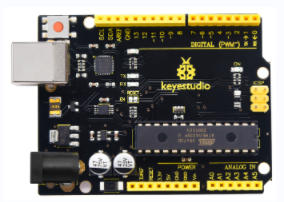                                                  | Keyestudio V4.0 development board (compatible Arduino UNO)     | 1   |
| 3   |                                               | Keyestudio 8833 Motor Driver Expansion Board                   | 1   |
| 4   |                                                | DX-BT24 V5.1 BLE BT Module                                     | 1   |
| 5   |                                                   | HC-SR04 Ultrasonic Sensor                                      | 1   |
| 6   |                                                   | Keyestudio 8\*16 LED Panel                                     | 1   |
| 7   | 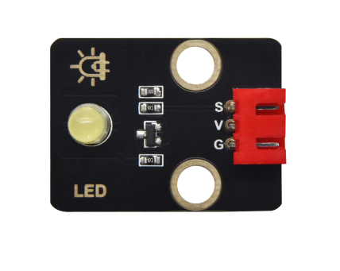                                                 | Yellow LED Module                                              | 1   |
| 8   |                                                  | Flame Sensor                                                   | 2   |
| 9   |                                                  | 130 Motor Module                                               | 1   |
| 10  |                                                  | Photoresistor                                                  | 2   |
| 11  |                                                  | Acrylic Board for 8\*16 LED Panel                              | 1   |
| 12  |                               | Top Acrylic Board                                              | 1   |
| 13  |  | Acrylic Board                                                  | 1   |
| 14  |                                                 | Keyestudio JMFP-4 17-Key Remote Control (Batteries in KS0555F) | 1   |
| 15  |                                                   | Keyestudio 9G 180 ° Servo                                      | 1   |
| 16  |                                                   | USB Cable                                                      | 1   |
| 17  |                                                   | Winding Pipe                                                   | .12 |
| 18  |                                                   | 3.0\*40MM Screwdriver                                          | 1   |
| 19  |                                                   | 3\*100MM Ties                                                  | 5   |
| 20  |                                                   | L Type M2.5 Wrench                                             | 1   |
| 21  |                                                   | L Type M3 Wrench                                               | 1   |
| 22  |                                                   | L Type M1.5 Wrench                                             | 1   |
| 23  |                                                   | Cardboard                                                      | 1   |
| 24  |                                                   | 4P M-F PH2.0mm to 2.54 Dupont Wire (Green-Blue-Red-Black)      | 1   |
| 25  |                                                  | 4P HX-2.54 Dupont Wire (Black-Red-White-Brown)                 | 1   |
| 26  |                                                   | 5P JST-PH2.0MM Dupont Wire                                     | 1   |
| 27  |                                                  | 3P-3P XH2.54 to 2.54 Dupont Wire（Yellow-Red-Black)             | 1   |
| 28  |                                               | 3P-3P XH2.54 to PH2.0 Dupont Wire（Yellow-Red-Black)            | 2   |
| 29  |                                                 | 4P-3P XH2.54 to PH2.0 Dupont Wire（Yellow-Red-Black)            | 2   |
| 30  |                                                  | 4P XH2.54 to PH2.0 Dupont Wire（Green-Blue-Red-Black)           | 1   |
| 31  |                                                   | M1.4\*8MM Round-head Screws                                    | 6   |
| 32  |                                                   | M1.4 Nuts                                                      | 6   |
| 33  |                                                   | M2 Nuts                                                        | 8   |
| 34  |                                                   | M2\*8MM Round-head Screws                                      | 8   |
| 35  |                                                   | M1.2\*5MM Round-head Screws                                    | 6   |
| 36  |                                                   | M3\*6MM Round-head Screws                                      | 18  |
| 37  |                                                   | M3\*10MM Round-head Screws                                     | 3   |
| 38  |                                                   | M3 Nuts                                                        | 3   |
| 39  |                                                   | M3\*10MM Dual-pass Copper Pillar                               | 4   |
| 40  |                               | M3\*40MM Dual-pass Copper Pillar                               | 4   |
| 41  |                                                  | 43093 Blue Technic Axle Pin with Friction Ridges               | 11  |
| 42  |                                                  | 4265c Technic Bush                                             | 11  |
| 43  |                                                   | Blue Jumper Cap                                                | 4   |
| 44  |                                                   | Red Jumper Cap                                                 | 4   |

## **5. Installation**

 **Caution**

Set the initial angle of the servo Peel thin films off boards before installing this robot 

| Step 1 |                                                                                                     

| Required Parts                                                                                                                                                                                                                                                                  |                                                                                                                                     |                                    |
|     |                                                                                                                                                                                       |                                    |
| Step 2                                                                                                                                                                                                                                                                          |                                                                                                                                                                                       |                                    |
| Required Parts                                                                                                                                                                                                                                                                  |                                                                                                                            |                                    |
|                                                                                                                                                           |                                                                                                                                                                                       |                                    |
| Step 3                                                                                                                                                                                                                                                                          |                                                                                                                                                                                       |                                    |
| Required Parts                                                                                                                                                                                                                                                                  |                                                                                                                            |                                    |
|    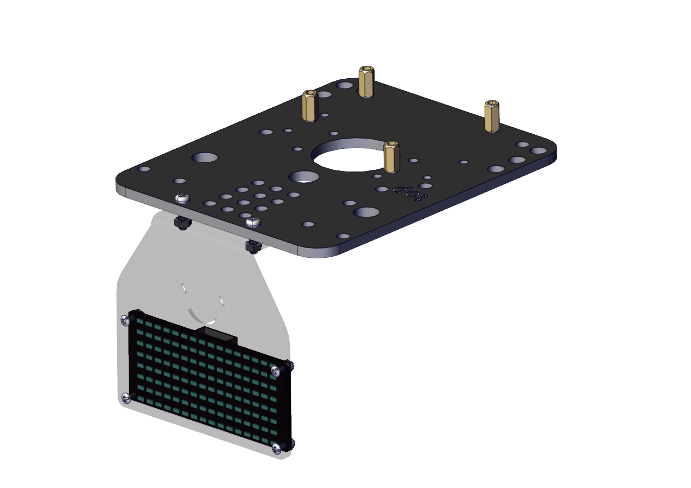                                                                                                                                                       |                                                                                                                                                                                       |                                    |
| Step 4                                                                                                                                                                                                                                                                          |                                                                                                                                                                                       |                                    |
| Required Parts                                                                                                                                                                                                                                                                  |                                                                                                                                |                                    |
|                                                                                                                                                           |                                                                                                                                                                                       |                                    |
| Step 5                                                                                                                                                                                                                                                                          |                                                                                                                                                                                       |                                    |
| Required Parts                                                                                                                                                                                                                                                                  |                                                                                                                            |                                    |
|                                                                                                                                                                                                                      |                                                                                                                                                                                       |                                    |
|                                                                                                                                                                                                                      |                                                                                                                                                                                       |                                    |
| Required Parts                                                                                                                                                                                                                                                                  |                                                                                                                                |                                    |
| Note: The direction of jumper caps                                                                                                                                                                                                                                              |                                                                                                                            |                                    |
|                                                                                                                                                                                                                      |                                                                                                                                                                                       |                                    |
| Step 7                                                                                                                                                                                                                                                                          |                                                                                                                                                                                       |                                    |
| Required Parts                                                                                                                                                                                                                                                                  | 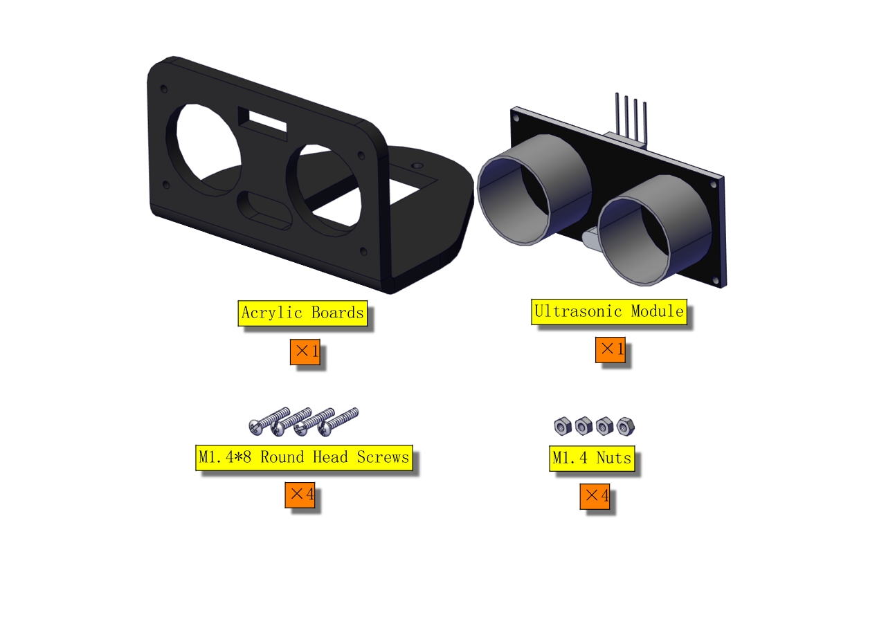                                                    |                                    |
|     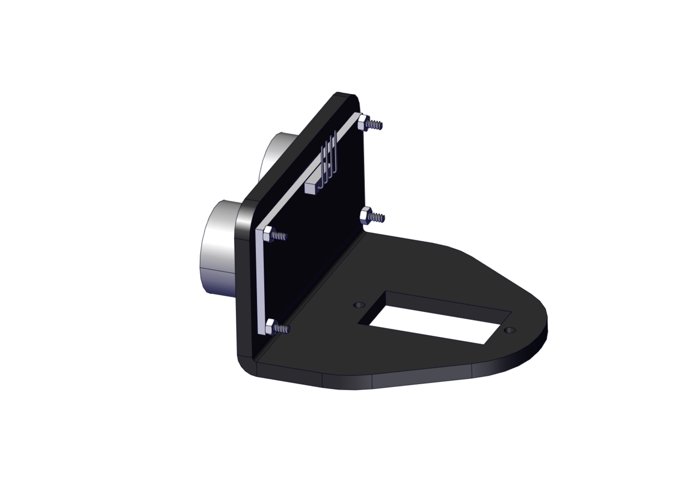                                                                                                                                                                    |                                                                                                                                                                                       |                                    |
| Step 8                                                                                                                                                                                                                                                                          |                                                                                                                                                                                       |                                    |
| Required Parts                                                                                                                                                                                                                                                                  |                                                                                                                                     |                                    |
|                                                                                                                                                                         |                                                                                                                                                                                       |                                    |
| Step 9（Need to adjust the angle of the servo）                                                                                                                                                                                                                                   |                                                                                                                                                                                       |                                    |
| Required Parts                                                                                                                                                                                                                                                                  |                                                                                                                                   |                                    |
| Set the angle of the servo to 90°                                                                                                                                                                                                                                               | Refer to the lesson 7 to set the servo. If you don’t know how to use it, learn the lesson 7 first.                                                                                    |                                    |
| Keep the ultrasonic sensor parallel to the board                                                                                                          |                                                                                                                                                                                       |                                    |
| Step 9                                                                                                                                                                                                                                                                          |                                                                                                                                                                                       |                                    |
| Required Parts                                                                                                                                                                                                                                                                  |                                                                                                                              |                                    |
|                                                                                                                                                       |                                                                                                                                                                                       |                                    |
| Required Parts                                                                                                                                                                                                                                                                  |                                                                                                                          |                                    |
| 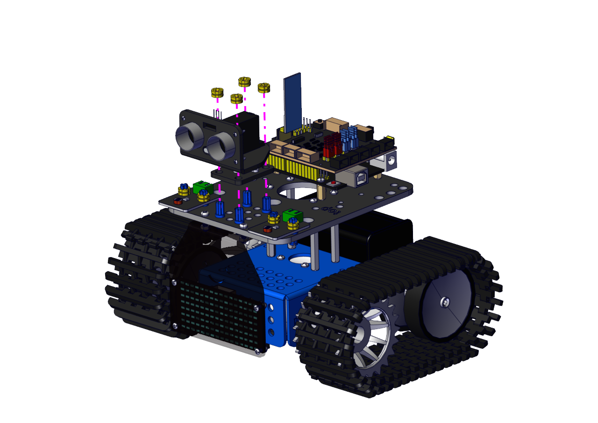                                                                                                                                                      |                                                                                                                                                                                       |                                    |
| Wire up                                                                                                                                                                                                                                                                         |                                                                                                                                                                                       |                                    |
| For 8\*16LED panel, Make wires connect to A4 and A5                                                                                                                                                                                                                             |          8\*16 LED Panel | Keyestudio 8833 Motor Driver Board |
| GND                                                                                                                                                                                                                                                                             | G                                                                                                                                                                                     |                                    |
| VCC                                                                                                                                                                                                                                                                             | V                                                                                                                                                                                     |                                    |
| SDA                                                                                                                                                                                                                                                                             | A4                                                                                                                                                                                    |                                    |
| SCL                                                                                                                                                                                                                                                                             | A5                                                                                                                                                                                    |                                    |

Connect

the motor A to B port and make the motor B to A port

 

Line Tracking Sensor(see the picture)

 

Wire up the photoresistor

 

| Left | Keyestudio 8833 Board |     | Right | Keyestudio 8833  Board |
| ---- | --------------------- | --- | ----- | ---------------------- |
| G    | G                     |     | G     | G                      |
| V    | V                     |     | V     | V                      |
| S    | A1                    |     | S     | A2                     |

Wire up ultrasonic sensors

| Ultrasonic Sensor | Keyestudio 8833 Board |
| ----------------- | --------------------- |
| Vcc               | V                     |
| Trig              | D12                   |
| Echo              | D13                   |
| Gnd               | G                     |

Wire up the servo(D10)

 

| Servo  | Keyestudio 8833 Board |
| ------ | --------------------- |
| Brown  | G                     |
| Red    | V(5V)                 |
| Orange | D10                   |

 Extinguishing Robot

Remove the ultrasonic sensor and two photoresistors

 

 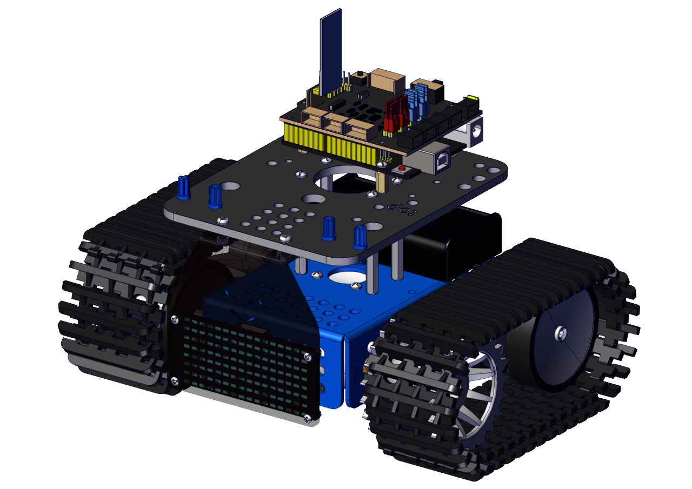

Put on a fan module and two flame sensors

 

You can make the fan module install further if the fan module and flame sensors
interfere

 

 Wire up

Wire up the fan module and two flame sensors

 

| Left | Keyestudio 8833 Board |     | Right | Keyestudio 8833 电Board |
| ---- | --------------------- | --- | ----- | ---------------------- |
| G    | G                     |     | G     | G                      |
| V    | V                     |     | V     | V                      |
| A    | A1                    |     | A     | A2                     |

| DC130 Motor | Keyestudio 8833   Board |
| ----------- | ----------------------- |
| G           | G                       |
| V           | V                       |
| IN+         | D12                     |
| IN-         | D13                     |

## **6. Install Arduino IDE and Driver**

1. **Installing Arduino IDE**

When you get control board, you need to download Arduino IDE and driver firstly.

You could download Arduino IDE from the official website:

<https://www.arduino.cc/>, click the **SOFTWARE** on the browse bar,
click“DOWNLOADS” to enter download page, as shown below:

There are various versions of IDE for Arduino. Just download a version
compatible with your system. Here we will show you how to download and install
the windows version of Arduino IDE.

There are two versions of IDE for WINDOWS system. You can choose between the
installer (.exe) and the Zip file. For installer, it can be directly downloaded,
without the need of installing it manually. However, for Zip package, you will
need to install the driver manually.

Click JUST DOWNLOAD.

1. **Keyestudio V4.0 Development Board**

You need to know that keyestudio V4.0 development board is the core of this
smart car.

Keyestudio V4.0 development board is based on ATmega328P MCU, and with a CP2102
Chip as a UART-to-USB converter.

It has 14 digital input/output pins (of which 6 can be used as PWM outputs), 6
analog inputs, a 16 MHz quartz crystal, a USB connection, a power jack, 2 ICSP
headers and a reset button.

We can power it with a USB cable, the external DC power jack

(DC 7-12V) or female headers Vin/ GND(DC 7-12V)

| Micro controller            | ATmega328P-PU                                            |
| --------------------------- | -------------------------------------------------------- |
| Operating Voltage           | 5V                                                       |
| Input Voltage (recommended) | DC7-12V                                                  |
| Digital I/O Pins            | 14 (D0-D13)  (of which 6 provide PWM output)             |
| PWM Digital I/O Pins        | 6 (D3, D5, D6, D9, D10, D11)                             |
| Analog Input Pins           | 6 (A0-A5)                                                |
| DC Current per I/O Pin      | 20 mA                                                    |
| DC Current for 3.3V Pin     | 50 mA                                                    |
| Flash Memory                | 32 KB (ATmega328P-PU) of which 0.5 KB used by bootloader |
| SRAM                        | 2 KB (ATmega328P-PU)                                     |
| EEPROM                      | 1 KB (ATmega328P-PU)                                     |
| Clock Speed                 | 16 MHz                                                   |
| LED_BUILTIN                 | D13                                                      |

1. **Installing the Driver of the V4.0 Board**

Let’s install the driver of keyestudio V4.0 board. The USB-TTL chip on V4.0
board adopts CP2102 serial chip. The driver program of this chip is included in
Arduino 1.8 version and above
(<https://www.silabs.com/products/development-tools/software/usb-to-uart-bridge-vcp-drivers>),
which is convenient. Plugging on USB port of board, the computer can recognize
the hardware and automatically install the driver of CP2102.

If you install unsuccessfully, or intend to install manually, please open the
device manager of computer. Right click Computer----- Properties----- Device
Manager

The yellow exclamation mark on the page implies an unsuccessful installation and
you should double click the hardware and update the driver.

Click“OK”to enter the following page. Click“browse my computer for updated
driver software”

Click “Browse”, then search the driver of CP2102 and click“Next”,

There is a DRIVERS folder in Arduino software installed package, open driver
folder and check the driver of CP210X series chips.

When opening the device manager, we will find the yellow exclamation mark
disappear. The driver of CP2102 is installed successfully.

1. **Arduino IDE Setting**

Clickicon，and open Arduino IDE.

When downloading the sketch to the board, you must select the correct name of
Arduino board that matches the board connected to your computer. As shown below;

Then select the correct COM port (you can see the corresponding COM port after
the driver is successfully installed)

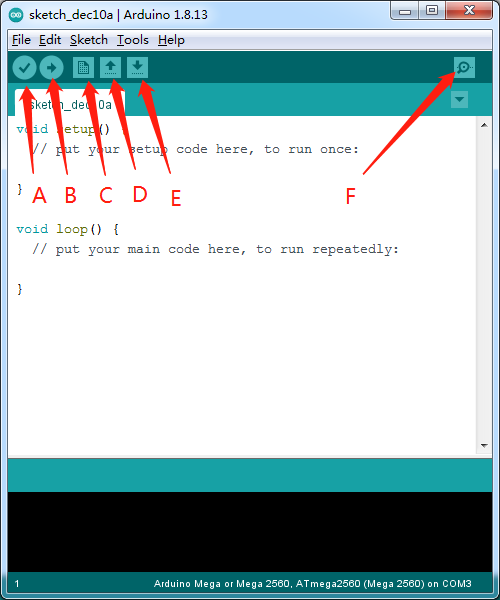

A- Used to verify whether there is any compiling mistakes or not.

B- Used to upload the sketch to your Arduino board.

C- Used to create shortcut window of a new sketch.

D- Used to directly open an example sketch.

E- Used to save the sketch.

F- Used to send the serial data received from board to the serial monitor.

**(5) Start First Program**

Open the file to select **Example**, and click **BASIC**\>**BLINK**, as shown
below:

Set the correct **COM port,** and the corresponding board and COM port are shown
on the lower right of IDE.

Clickto upload the program

After the program is uploaded successfully, the onboard LED blinks.
Congratulation, you finish the first program.

**7. How to Add a Library?**

**(1) What are Libraries ?**

[Libraries](https://www.arduino.cc/en/Reference/Libraries) are a collection of
code that make it easy for you to connect a sensor,display, module, etc.

For example, the built-in LiquidCrystal library helps talk to LCD displays.
There are hundreds of additional libraries available on the Internet for
download.

The built-in libraries and some of these additional libraries are listed in the
reference.

**(2) How to Install a Library ?**

Here we will introduce the most simple way to add libraries .

**Step 1：**After downloading well the Arduino IDE, you can right-click the icon
of Arduino IDE.

Find the option "Open file location"

**Step 2:** Click Open file location \>libraries

**Step 3：**Next, find out the“libraries”folder of tank robot(seen in the link:
https://fs.keyestudio.com/KS0555

Copy them into libraries of Arduino

## **7. Projects**

In this section, we will start from a single sensor to complex experiments to
introduce you how the tank robot works

Note: (G), marked on each sensor and module, is the negative pole and connected
to“G”, ”-”or “GND”on the sensor shield or control board ; (V) is the positive
pole and linked with V , VCC, + or 5V on the sensor shield or control board.

### Project 1: LED Blinks

(1) Description：

For starters and enthusiasts, LED Blink is a fundamental program. LED, the
abbreviation of light emitting diodes, consists of Ga, As, P, N chemical
compounds and so on. The LED can flash in diverse colors by altering the delay
time in the test code. When in control, power on GND and VCC, the LED will be on
if S end is in high level; nevertheless, it will go off.

(2）Parameters：

Control interface: digital port

Working voltage: DC 3.3-5V

Pin spacing: 2.54mm

LED display color: yellow

(3) Components Required

| Keyestudio V4.0 development board \*1              | Keyestudio 8833 Motor  Driver Expansion Board\*1    | Yellow LED Module\*1                             |
| -------------------------------------------------- | --------------------------------------------------- | ------------------------------------------------ |
|     |  |  |
| 3P-3P XH2.54 to 2.54 Dupont Wire（Yellow-Red-Black) | USB Cable\*1                                        |                                                  |
|    |      |                                                  |

（4）Motor driver expansion board

The Keyestudio 8833 motor driver expansion board is compatible with the Arduino
UNO development board. Just stack it onto the development board when using it.

1. Connection Diagram：

LED is connected to D9 port, and remember to install jumper caps onto the shield

1. Test Code:

/\*

Keyestudio Mini Tank Robot V3 (Popular Edition)

lesson 1.1

Blink

http://www.keyestudio.com

\*/

int LED = 9; //Define the pin of LED to connect with digital port 3

void setup()

{

pinMode(LED, OUTPUT); //Initialize the LED pin to output mode

}

void loop() //infinite loop

{

digitalWrite(LED, HIGH); //Output high level and turn on the LED

delay(1000); //Wait for 1s

digitalWrite(LED, LOW); //Output low level and turn on LED

delay(1000); //Wait for 1s

}\*

1. Test Results：

Upload the program, LED blinks at the interval of 1s.

(8) Code Explanation

**pinMode(LED，OUTPUT) -** This function can denote that the pin is INPUT or
OUTPUT

**digitalWrite(LED，HIGH) -** When pin is OUTPUT, we can set it to HIGH(output
5V) or LOW(output 0V)

1. Extension Practice:

We have succeeded in blinking LED. Next, let’s observe what will happen to the
LED if we modify pins and delay time.

/\*

Keyestudio Mini Tank Robot V3 (Popular Edition)

lesson 1.2

Blink

http://www.keyestudio.com

\*/

int LED = 9; //Define the pin of the LED as 9

void setup()

{

pinMode(LED, OUTPUT); //Set the pin of the LED to OUTPUT

}

void loop() //Infinite loop

{

digitalWrite(LED, HIGH); //output high levels, light up LED

delay(100); //Wait for 0.1s

digitalWrite(LED, LOW); //LED output low levels, turn off LED

delay(100); //Wait for 0.1s

}

The test result shows that the LED flashes faster. Therefore, we can draw a
conclusion that pins and time delaying affect flash frequency.

### Project 2: Adjust LED Brightness

(1) Description：

In previous lesson, we control LED on and off and make it blink.

In this project, we will control LED’s brightness through PWM simulating
breathing effect. Similarly, you can change the step length and delay time in
the code so as to demonstrate different breathing effects.

PWM is a means of controlling the analog output via digital means. Digital
control is used to generate square waves with different duty cycles (a signal
that constantly switches between high and low levels) to control the analog
output.In general, the input voltages of ports are 0V and 5V. What if the 3V is
required? Or a switch among 1V, 3V and 3.5V? We cannot change resistors
constantly. For this reason, we resort to PWM.

For Arduino digital port voltage outputs, there are only LOW and HIGH levels,
which correspond to the voltage outputs of 0V and 5V respectively. You can
define LOW as“0”and HIGH as“1’, and let the Arduino output five
hundred‘0’or‘1’within 1 second. If output five hundred‘1’, that is 5V; if all of
which is‘0’,that is 0V; if output 250 01 pattern, that is 2.5V.

This process can be likened to showing a movie. The movie we watch are not
completely continuous. Actually, it generates 25 pictures per second, which
cannot be told by human eyes. Therefore, we mistake it as a continuous process.
PWM works in the same way. To output different voltages, we need to control the
ratio of 0 and 1. The more‘0’or‘1’ output per unit time, the more accurate the
control.

(2) Parameters：

Control interface: Digital port 3

Working voltage: DC 3.3-5V

Pin spacing: 2.54mm

LED display color: yellow

1. Components Required

| keyestudio V4.0 development board \*1                 | Keyestudio 8833 Motor Driver Expansion Board\*1     | Yellow LED Module\*1                             |
| ----------------------------------------------------- | --------------------------------------------------- | ------------------------------------------------ |
|        |  |  |
| 3P-3P XH2.54 to 2.54 Dupont Wire（Yellow-Red-Black)\*1 | USB Cable\*1                                        |                                                  |
|       |      |                                                  |

1. Connection Diagram：

PWM pins of Arduino are connected to 3，5，6，9，10 and 11. Keep the pin 9
unchanged

（5）Test Code:

/\*

Keyestudio Mini Tank Robot V3 (Popular Edition)

lesson 2.1

pwm

http://www.keyestudio.com

\*/

int LED = 9; //Define the pin of the LED as 9

void setup () {

pinMode (LED, OUTPUT); //Set the pin of the LED to OUTPUT

}

void loop () {

for (int value = 0; value \< 255; value = value + 1) {

analogWrite (LED, value); // LED ON

delay (5); //delay in 5ms

}

for (int value = 255; value \> 0; value = value - 1) {

analogWrite (LED, value); //LED gets dim

delay (5); //delay in 5ms

}

}

\*\*\*\*

(6) Test Results：

Upload test code successfully, LED gradually changes from bright to dark, like
human’s breath, rather than turning on and off immediately.

(7) Code Explanation:

To repeat some certain statements, we could use FOR statement. FOR statement
format is shown below:

FOR cyclic sequence:

Round 1：1 → 2 → 3 → 4

Round 2：2 → 3 → 4

…

Until number 2 is not established, “for”loop is over.

After knowing this order, go back to code:

**for (int value = 0; value \< 255; value=value+1){**

**...}**

**for (int value = 255; value \>0; value=value-1){**

**...}**

The two“for”statements make value increase from 0 to 255, then reduce from 255
to 0, then increase to 255,....infinitely loop

There is a new function in the following ----- analogWrite()

We know that digital port only has two state of 0 and 1. So how to send an
analog value to a digital value? Here,this function is needed. Let’s observe the
Arduino board and find 6 pins marked“\~”which can output PWM signals.

Function format as follows:

**analogWrite(pin,value)**

analogWrite() is used to write an analog value from 0\~255 for PWM port, so the
value is in the range of 0\~255. Attention that you only write the digital pins
with PWM function, such as pin 3, 5, 6, 9, 10, 11.

PWM is a technology to obtain analog quantity through digital method. Digital
control forms a square wave, and the square wave signal only has two states of
turning on and off (that is, high or low levels). By controlling the ratio of
the duration of turning on and off, a voltage varying from 0 to 5V can be
simulated. The time turning on(academically referred to as high level) is called
pulse width, so PWM is also called pulse width modulation.

Through the following five square waves, let’s acknowledge more about PWM.

In the above figure, the green line represents a period, and value of
analogWrite() corresponds to a percentage which is called Duty Cycle as well.
Duty cycle implies that high-level duration is divided by low-level duration in
a cycle. From top to bottom, the duty cycle of first square wave is 0% and its
corresponding value is 0. The LED brightness is lowest, that is, light off. The
more time the high level lasts, the brighter the LED. Therefore, the last duty
cycle is 100%, which correspond to 255, and LED is the brightest. And 25% means
darker.

PWM mostly is used for adjusting the LED’s brightness or the rotation speed of
motors.

It plays a vital role in controlling smart robot cars. I believe that you cannot
wait to learn next project.

(8) Extension Practice：

Let’s modify the value of delay and remain the pin unchanged, then observe how
LED changes.

/\*

Keyestudio Mini Tank Robot V3 (Popular Edition)

lesson 2.2

pwm-slow

http://www.keyestudio.com

\*/

int LED = 9; //Define the pin of the LED as 9

void setup () {

pinMode (LED, OUTPUT); //Set the pin of the LED to OUTPUT

}

void loop () {

for (int value = 0; value \< 255; value = value + 1) {

analogWrite (LED, value); // LED ON

delay (30); // delay in 30ms

}

for (int value = 255; value \> 0; value = value - 1) {

analogWrite (LED, value); //LED gets dim

delay (30); // delay in 30ms

}

}

\*\*\*\*

Upload the code to development board, LED flashes more slowly.

### Project 3: Photoresistor

(1) Description：

The photosensitive resistor is a special resistor made of a semiconductor
material such as a sulfide or selenium, and a moisture-proof resin is also
coated with a photoconductive effect. The photosensitive resistance is most
sensitive to the ambient light, different illumination strength, and the
resistance of the photosensitive resistance is different. We use the
photosensitive resistance to design the photosensitive resistor module. The
module signal is connected to the microcontroller analog port. When the light
intensity is stronger, the larger the analog port voltage, that is, the
simulation value of the microcontroller is also large; in turn, when the light
intensity is weaker, the smaller the analog port voltage, that is, the
simulation value of the microcontroller is also small. . In this way, we can
read the corresponding analog value using the photosensitive resistor module,
and the intensity of the light in the inductive environment.

1. Parameters：

Photosensitive resistance resistance value: 5K Ou-0.5m

Interface type: simulation port A0, A1

Working voltage: 3.3V-5V

Pin spacing: 2.54mm

1. Components Needed:

| keyestudio V4.0 development board \*1            | Keyestudio 8833 Motor Driver Expansion Board\*1        | Yellow LED Module\*1                             | 3P-3P XH2.54 to 2.54 Dupont Wire（Yellow-Red-Black)\*1 |
| ------------------------------------------------ | ------------------------------------------------------ | ------------------------------------------------ | ----------------------------------------------------- |
|   |     |  |       |
| Photoresistor \*1                                | 3P-3P XH2.54 to PH2.0 Dupont Wire（Yellow-Red-Black)\*1 | USB Cable\*1                                     |                                                       |
|  |     |   |                                                       |

1. Connection Diagram

This photoresistor is connected to A1 and A2

Let’s read its analog value first.

1. Test Code:

/\*

Keyestudio Mini Tank Robot V3 (Popular Edition)

lesson 3.1

photocell

http://www.keyestudio.com

\*/

int sensorPin = A1; // A1 is the input pin of photoresistor

int sensorValue = 0; // save the value of photoresistors

void setup() {

Serial.begin(9600); //Open the serial port monitor and set the baud rate to 9600

}

void loop() {

sensorValue = analogRead(sensorPin); //Read the analog value from the
photoresistor sensor

Serial.println(sensorValue); //The serial port prints the value of the
photoresistor

delay(500); //Delay in 500ms

}

1. Test Results：

When covering it, the value gets smaller; if not, the value gets larger

1. Code Explanation:

**analogRead(sensorPin)：read the analog value of photoresistors**

**Serial.begin(9600)：initialize serial port and set baud rate to 9600**

**Serial.println：**serial prints

1. Extension Practice:

We know the value of the photoresistor. How about controlling the LED’s
brightness by it?

The LED’s brightness is controlled by PWM. Therefore, we connect the LED to PMW
pin(pin 9) of the shield.

/\*

Keyestudio Mini Tank Robot V3 (Popular Edition)

lesson 3.2

photocell-analog output

http://www.keyestudio.com

\*/

int analogInPin = A1; // A1 is the input pin of photoresistor

int analogOutPin = 9; // Digital port 9 is the output of PMW

int sensorValue = 0; // save the variable of the resistance value of
photoresistors

int outputValue = 0; // Value output to PMW

void setup() {

Serial.begin(9600); //Open the serial port monitor and set the baud rate to 9600

}

void loop() {

sensorValue = analogRead(analogInPin); //Read the analog value from the
photoresistor sensor

// Map the analog values 0\~1023 to the PWM output values 255\~0

outputValue = map(sensorValue, 0, 1023, 255, 0);

// Change analog output

analogWrite(analogOutPin, outputValue);

//

//

Serial.println(sensorValue); //The serial port prints the value of the
photoresistor

delay(2);

}

\*

Upload code to the development board, then cove the photoresistor and observe
the LED’s brightness.

### Project 4: Line Tracking Sensor

(1) Description：

The tracking sensor is actually an infrared sensor. The component used here is
the TCRT5000 infrared tube.

Its working principle is to use different reflectivity of infrared light to
colors, then convert the strength of the reflected signal into a current signal.

During the process of detection, black is active at HIGH level while white is
active at LOW level. The detection height is 0-3 cm.

Keyestudio 3-channel line tracking module has integrated 3 sets of TCRT5000
infrared tube on a single board, which is more convenient for wiring and
control.

By rotating the adjustable potentiometer on the sensor, it can adjust the
detection sensitivity of the sensor.

1. Parameters：

Operating Voltage: 3.3-5V (DC)

Interface: 5PIN

Output Signal: Digital signal

Detection Height: 0-3 cm

Special note: before testing,rotate the potentiometer on the sensor to adjust
the detection sensitivity. When adjust the LED at the threshold between ON and
OFF, the sensitivity is the best.

1. Components Required

| Keyestudio V4.0 development board \*1            | Keyestudio 8833 Motor Driver Expansion Board\*1     | Yellow LED Module\*1                             | 3P-3P XH2.54 to 2.54 Dupont Wire（Yellow-Red-Black)\*1 |
| ------------------------------------------------ | --------------------------------------------------- | ------------------------------------------------ | ----------------------------------------------------- |
|   |  |  |       |
| Tank Robot Chassis \*1                           | 5P JST-PH2.0MM Dupont Wire\*1                       | USB Cable\*1                                     |                                                       |
|  |      |   |                                                       |

Note: the line tracking sensor is installed under the bottom of the robot.

(4)Connection Diagram：

(5) Test Code:

/\*

Keyestudio Mini Tank Robot V3 (Popular Edition)

lesson 4.1

Line Track sensor

http://www.keyestudio.com

\*/

//The wiring of line tracking sensors

\#define L_pin 11 //left

\#define M_pin 7 //middle

\#define R_pin 8 //right

void setup()

{

Serial.begin(9600); //Set the baud rate to 9600

pinMode(L_pin, INPUT); //Set all pins of the line tracking sensors to input mode

pinMode(M_pin, INPUT);

pinMode(R_pin, INPUT);

}

void loop ()

{

int L_val = digitalRead(L_pin); //Read the value of the left sensor

int M_val = digitalRead(M_pin); //Read the value of the middle sensor

int R_val = digitalRead(R_pin); //Read the value of the right sensor

Serial.print(L_val);

Serial.print(" ");

Serial.print(M_val);

Serial.print(" ");

Serial.print(R_val);

Serial.println(" ");

delay(100); //delay in 100ms

}

(6) Test Results：

Upload the code on development board, open serial monitor to check line tracking
sensors. And the displayed value is 1(high level) when no signals are received.
The value shifts into 0 when the sensor is covered with paper.

(7) Code Explanation:

**Serial.begin(9600)**- Initialize serial port, set baud rate to 9600

**pinMode-** Define the pin as input or output mode

**digitalRead-**Read the state of pin, which are generally HIGH and LOW level

(8) Extension Practice：

After knowing its working principle, you can connect an LED to D9. so as to
control LED by line tracking sensor.

Test Code

/\*

Keyestudio Mini Tank Robot V3 (Popular Edition)

lesson 4.2

Line Track sensor

http://www.keyestudio.com

\*/

//LED pin

\#define LED 9

//The wiring of line tracking sensors

\#define L_pin 11 //left

\#define M_pin 7 //middle

\#define R_pin 8 //right

void setup(){

Serial.begin(9600); //Set the baud rate to 9600

pinMode(LED, OUTPUT); //Set LED to output mode

pinMode(L_pin, INPUT); //Set all pins of the line tracking sensors to input mode

pinMode(M_pin, INPUT);

pinMode(R_pin, INPUT);

}

void loop (){

int L_val = digitalRead(L_pin); //Read the value of the left sensor

int M_val = digitalRead(M_pin); //Read the value of the middle sensor

int R_val = digitalRead(R_pin); //Read the value of the right sensor

Serial.print(L_val);

Serial.print(" ");

Serial.print(M_val);

Serial.print(" ");

Serial.print(R_val);

Serial.println(" ");

delay(100); //Delay in 100ms

if (L_val == 0 \|\| M_val == 0 \|\| R_val == 0) {

digitalWrite(LED, HIGH);

}

else {

digitalWrite(LED, LOW);

}

}

//\*\*

### Project 5: Flame Sensor

1. Description：

The flame sensor uses IR receiving tube to detect flames, converts the
brightness of the flame into signals with high and low levels, input them into
the central processor. The corresponding program processing. In both flames
close to and without flames, the voltage value of the analog port is varied.

If there is no flame, the analog port is about 0.3V; when there is a flame, the
analog port is 1.0V. The closer the flame is , the more the voltage value is. It
can be used to detect the fire source or make a smart robot.

Note the probe of flame sensors only bears the temperature between -25 ℃and
～85℃

In the process of use, pay attention to keep the flame sensor in certain
distance to avoid getting damaged.

1. Parameters：

Working voltage: 3.3V-5V (DC)

Current: 100mA

Maximum power: 0.5W

Work temperature: -10 ° C to +50 degrees Celsius

Sensor size: 31.6mmx23.7mm

Interface: 4pin turn 3PIN interface

Output signal: analog signals A0, A1

1. Components Needed:

| keyestudio V4.0 development board \*1            | Keyestudio 8833 Motor Driver Expansion Board\*1      | Yellow LED Module\*1                             | 3P-3P XH2.54 to 2.54 Dupont Wire（Yellow-Red-Black)\*1 |
| ------------------------------------------------ | ---------------------------------------------------- | ------------------------------------------------ | ----------------------------------------------------- |
|   |   |  |       |
| Flame Sensor\*1                                  | 4P-3P XH2.54 to PH2.0  Dupont Wire（Yellow-Red-Black) | USB Cable\*1                                     |                                                       |
|  |     |   |                                                       |

1. Connection Diagram：

Flame sensors are connected to A1 and A2. When we remove ultrasonic sensors and
photoresistors, then add flame sensors and fan modules.

The fire extinguishing robot is created.

(5) Test Code:

/\*

Keyestudio Mini Tank Robot V3 (Popular Edition)

lesson 5.1

flame sensor

http://www.keyestudio.com

\*/

int flame = A1; //Define the flame pin as analog pin A1

int val = 0; //Define digital variables

void setup() {

pinMode(flame, INPUT); //Define the buzzer as an input source

Serial.begin(9600); //Set the baud rate to 9600

}

void loop() {

val = analogRead(flame); //Read the analog value of the flame sensor

Serial.println(val);//Output analog value and print it

delay(100); //Delay in 100ms

}

//\*\*\*\*\*

(6）Test Result：

Wire up components, burn the code, open the serial monitor and set the baud rate
to 9600.

You can view the simulation value of flame sensor.

The closer the flame, the smaller the simulation value.

Adjust the potentiometer on the module to maintain D1 at the critical point.
When the sensor does not detect flame, the D1 will be off, but if the sensor
detects flame, the D1 will be on.

(7) Extension Practice:

Next, connect an LED to pin 9 and we can control it by a flame sensor, as shown
below;

/\*

Keyestudio Mini Tank Robot V3 (Popular Edition)

lesson 5.2

flame sensor

http://www.keyestudio.com

\*/

int flame = A1; //Define the flame pin as analog pin A1

int LED = 9; //Define the LED as digital port 9

int val = 0; //Define digital variables

void setup() {

pinMode(flame, INPUT); //Define the buzzer as an input source

pinMode(LED, OUTPUT); //Set LED to output mode

Serial.begin(9600); //Set the baud rate to 9600

}

void loop() {

val = analogRead(flame); //Read the analog value of the flame sensor

Serial.println(val);//Output analog value and print it

if (val \< 300) { //When analog value is less than 300, LED is on

digitalWrite(LED, HIGH); //LED is on

} else {

digitalWrite(LED, LOW); //LED is off

}

delay(50); //Delay in 50ms

}

\*\*\*\*

### Project 6: Fan

(1) Description：

This fan module uses a HR1124S motor-controlling chip, a single-channel H-bridge
driver chip containing a low-conductivity resistance PMOS and NMOS power tubes.
The low-conducting resistance can ease the power consumption, contributing to
the safe work of the chip for longer time.

In addition, its low standby current and low static working current makes itself
apply to toys. We can control the rotation direction and speed of the fan by
outputting IN + and IN- signals and PWM signals.

1. Specification

Working voltage: 5V

Current: 200MA

Maximum power: 2W

Operating temperature: -10 degrees Celsius to +50 degrees Celsius

Size: 47.6MM \*23.8MM

1. Components Required

| keyestudio V4.0 development board \*1            | Keyestudio 8833 Motor Driver Expansion Board\*1     | 130 Motor \*1                                    | 4P XH2.54 to PH2.0 Dupont Wire（Green-Blue-Red-Black) \*1 |
| ------------------------------------------------ | --------------------------------------------------- | ------------------------------------------------ | -------------------------------------------------------- |
|   |  |  |          |
| Flame Sensor\*1                                  | 4P-3P XH2.54 to PH2.0 Dupont Wire（Yellow-Red-Black) | USB Cable\*1                                     | Tank Robot Chassis                                       |
|  |    |   |          |

The fan module needs driving by large current; therefore, we install a battery
holder.

1. Connection Diagram

The pin GND, VCC, IN+ and IN- of the fan module are connected to pin G, V, 12
and 13 of the shield.

1. Test Code:

/\*

Keyestudio Mini Tank Robot V3 (Popular Edition)

lesson 6.1

130 motor

http://www.keyestudio.com

\*/

int INA = 12;

int INB = 13;

void setup() {

pinMode(INA, OUTPUT);//Set digital port INA as output

pinMode(INB, OUTPUT);//Set digital port INA as output

}

void loop() {

//Set the fan to rotate anticlockwise for 3s

digitalWrite(INA, LOW);

digitalWrite(INB, HIGH);

delay(3000);

//Set the fan to stop for 1s

digitalWrite(INA, LOW);

digitalWrite(INB, LOW);

delay(1000);

//Set the fan to rotate clockwise for 3s

digitalWrite(INA, HIGH);

digitalWrite(INB, LOW);

delay(3000);

}

//\*

(7) Test Results：

Upload code, wire up components and plug in power. The small fan will turn
anticlockwise for 3000ms, stop for 1000ms, and clockwise for 300ms.

(8) Extension Practice:

We have understood the working principle of the flame sensor. Next, hook up a
flame sensor in the circuit , as shown below. Then control the fan to blew out
fire with the flame sensor.

/\*

Keyestudio Mini Tank Robot V3 (Popular Edition)

lesson 6.2

130 motor

http://www.keyestudio.com

\*/

int INA = 12;

int INB = 13;

int flame = A1; //Define the flame pin as analog pin A1

int val = 0; //Define digital variables

void setup() {

pinMode(INA, OUTPUT);//Set digital port INA as output

pinMode(INB, OUTPUT);//Set digital port INA as output

pinMode(flame, INPUT); //Define the buzzer as an input source

}

void loop() {

val = analogRead(flame); //Read the analog value of the flame sensor

if (val \<= 700) { //When analog value≤700, LED is on

//Turn on the fan when flame is detected

digitalWrite(INA, LOW);

digitalWrite(INB, HIGH);

} else {

//Otherwise it stops operating

digitalWrite(INA, LOW);

digitalWrite(INB, LOW);

}

}

//\*

### Project 7: Servo Control

1. Description

Servo motor is a position control rotary actuator. It mainly consists of a
housing, a circuit board, a core-less motor, a gear and a position sensor. Its
working principle is that the servo receives the signal sent by MCU or receiver
and produces a reference signal with a period of 20ms and width of 1.5ms, then
compares the acquired DC bias voltage to the voltage of the potentiometer and
obtain the voltage difference output.

When the motor speed is constant, the potentiometer is driven to rotate through
the cascade reduction gear, which leads that the voltage difference is 0, and
the motor stops rotating. Generally, the angle range of servo rotation is 0°
\--180 °

The rotation angle of servo motor is controlled by regulating the duty cycle of
PWM (Pulse-Width Modulation) signal. The standard cycle of PWM signal is 20ms
(50Hz). Theoretically, the width is distributed between 1ms-2ms, but in fact,
it's between 0.5ms-2.5ms. The width corresponds the rotation angle from 0° to
180°. But note that for different brand motors, the same signal may have
different rotation angles.

In general, servo has three lines in brown, red and orange. The brown wire is
grounded, the red one is a positive pole line and the orange one is a signal
line.

The angle of the servo:

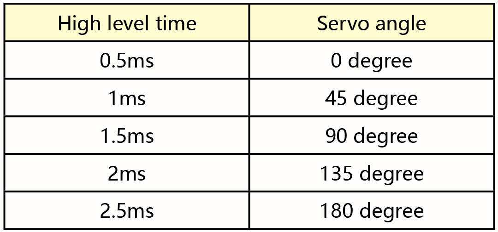

1. Parameters

Working voltage: DC 4.8V \~ 6V

Operating angle range: about 180 ° (at 500 → 2500 μsec)

Pulse width range: 500 → 2500 μsec

No-load speed: 0.12 ± 0.01 sec / 60 (DC 4.8V) 0.1 ± 0.01 sec / 60 (DC 6V)

No-load current: 200 ± 20mA (DC 4.8V) 220 ± 20mA (DC 6V)

Stopping torque: 1.3 ± 0.01kg · cm (DC 4.8V) 1.5 ± 0.1kg · cm (DC 6V)

Stop current: ≦ 850mA (DC 4.8V) ≦ 1000mA (DC 6V)

Standby current: 3 ± 1mA (DC 4.8V) 4 ± 1mA (DC 6V)

1. Components Required

| Keyestudio V4.0 development board \*1            | Keyestudio 8833 Motor Driver Expansion Board\*1     | Keyestudio 9G Servo                             |
| ------------------------------------------------ | --------------------------------------------------- | ----------------------------------------------- |
|   |  |  |
| Tank Robot Chassis \*1                           | USB Cable\*1                                        |                                                 |
|  |      |                                                 |

(4)Connection Diagram：

Note: The brown, red and orange wire of the servo are respectively attached to
Gnd(G), 5v(V) and 10 of the shield. Remember to connect an external power
because of the high current of the servo. If not, the development board will be
burnt out.

(5) Test Code 1：

/\*

Keyestudio Mini Tank Robot V3 (Popular Edition)

lesson 7.1

Servo

http://www.keyestudio.com

\*/

\#define servoPin 10 //The pin of servo

int pos; //The variable of servo’s angle

int pulsewidth; //The variable of servo’s pulse width

void setup() {

pinMode(servoPin, OUTPUT); //Set the pin of servo as output

procedure(0); //Set the angle of servo to 0°

}

void loop() {

for (pos = 0; pos \<= 180; pos += 1) { // From 1°to 180°

// in steps of 1 degree

procedure(pos); // Rotate to the angle of 'pos'

delay(15); //Control the speed of rotation

}

for (pos = 180; pos \>= 0; pos -= 1) { // From 180° to 1°

procedure(pos); // Rotate to the angle of 'pos'

delay(15);

}

}

//The function controls the servo

void procedure(int myangle) {

pulsewidth = myangle \* 11 + 500; //Calculate the value of pulse width

digitalWrite(servoPin, HIGH);

delayMicroseconds(pulsewidth); //The time in high level represents the pulse
width

digitalWrite(servoPin, LOW);

delay((20 - pulsewidth / 1000)); //As the cycle is 20ms, the time left is in low
level

}

\*\*

Upload code, we will see the servo move from 0° to 180°. In the further
chapters, we will introduce how to drive a servo. Additionally, we can control a
servo with a servo library of Arduino.

Note: This servo library file uses timer 1, and the PWM output of IO ports 9 and
10 also uses timer 1, so we cannot use this servo library when using the PWM
output of D9 and D10 later.

You can refer to the use of the servo library:
<https://www.arduino.cc/en/Reference/Servo>.

1. Test Code2:

/\*

Keyestudio Mini Tank Robot V3 (Popular Edition)

lesson 7.2

Servo

<http://www.keyestudio.com>

\*/

\#include \<Servo.h\>

Servo myservo; // create servos

int pos = 0; // Save the variables of angle

void setup() {

myservo.attach(10); //Connect the servo with digital port 10

}

void loop() {

for (pos = 0; pos \<= 180; pos += 1) { //From 0° to 180°

//step length is 1

myservo.write(pos); // Rotate to the angle of 'pos'

delay(15); // Wait for 15ms to control speed

}

for (pos = 180; pos \>= 0; pos -= 1) { //From 180° to 0°

myservo.write(pos); // Rotate to the angle of 'pos'

delay(15); // Wait for 15ms to control speed

}

}

1. Test Results：

Upload code, plug in power and servo moves in the range of 0° and 180°.

1. Code Explanation

Arduino comes with **\#include \<Servo.h\>** (servo function and statement）

The following are some common statements of the servo function:

1\. **attach（interface）**——Set servo interface, port 9 and 10 are available

2\. **write（angle）**——The statement to set rotation angle of servo, the angle
range is from 0° to 180°

3\. **read（）**——The statement to read angle of servo, read the command value of
“write()”

4. attached（）——Judge if the parameter of servo is sent to its interface

Note: The above written format is“servo variable name, specific statement（）”,
for instance: myservo.attach(10)

### Project 8: Ultrasonic Sensor

1. **Description：**

The HC-SR04 ultrasonic sensor uses sonar to determine distance to an object like
what bats do. It offers excellent non-contact range detection with high accuracy
and stable readings in an easy-to-use package. It comes complete with ultrasonic
transmitter and receiver modules.

The HC-SR04 or the ultrasonic sensor is being used in a wide range of
electronics projects for creating obstacle detection and distance measuring
application as well as various other applications. Here we have brought the
simple method to measure the distance with arduino and ultrasonic sensor and how
to use ultrasonic sensor with arduino.

(2）Parameters：

Power Supply :+5V DC

Quiescent Current : \<2mA

Working Current: 15mA

Effectual Angle: \<15°

Ranging Distance : 2cm – 400 cm

Resolution : 0.3 cm

Measuring Angle: 30 degree

Trigger Input Pulse width: 10uS

(3) Components Required

| keyestudio V4.0 development board \*1           | Keyestudio 8833 Motor Driver Expansion Board\*1     | Yellow LED Module\*1                             | 3P-3P XH2.54 to 2.54 Dupont Wire（Yellow-Red-Black)\*1 |
| ----------------------------------------------- | --------------------------------------------------- | ------------------------------------------------ | ----------------------------------------------------- |
|  |  |  |       |
| HC-SR04 Ultrasonic Sensor\*1                    | 4P M-F PH2.0mm to 2.54 Dupont Wire                  | USB Cable\*1                                     | Tank Robot Chassis \*1                                |
|  |      |   |       |

**(4) The principle of ultrasonic sensor**

As the above picture shown, it is like two eyes. One is transmitting end, the
other is receiving end.

The ultrasonic module will emit the ultrasonic waves after triggering a signal.
When the ultrasonic waves encounter the object and are reflected back, the
module outputs an echo signal, so it can determine the distance of the object
from the time difference between the trigger signal and echo signal.

The t is the time that emitting signal meets obstacle and returns. And the
propagation speed of sound in the air is about 343m/s, and distance = speed \*
time. However, the ultrasonic wave emits and comes back, which is 2 times of
distance. Therefore, it needs to be divided by 2, the distance measured by
ultrasonic wave = (speed \* time)/2

1. Use method and timing chart of ultrasonic module:

2. Setting the delay time of Trig pin of SR04 to 10μs at least, which can
   trigger it to detect distance.

3. After triggering, the module will automatically send eight 40KHz ultrasonic
   pulses and detect whether there is a signal return. This step will be
   completed automatically by the module.

4. If the signal returns, the Echo pin will output a high level, and the
   duration of the high level is the time from the transmission of the
   ultrasonic wave to the return.

|  |
| ----------------------------------------------- |

Circuit diagram of ultrasonic sensor:

1. **Connection Diagram：**

1. **Connection Diagram：**

Note: The pin VCC, Trig, Echo and Gnd of the ultrasonic sensor are respectively
connected to 5v(V), 12(S), 13(S) and Gnd(G) of the shield

1. Test Code:

/\*

Keyestudio Mini Tank Robot V3 (Popular Edition)

lesson 8.1

Ultrasonic sensor

http://www.keyestudio.com

\*/

int trigPin = 12; // Pin Trig attaches to 12

int echoPin = 13; //Pin Echo attaches to 13

long duration, cm, inches;

void setup() {

//Serial Port begin

Serial.begin (9600);//Set the baud rate to 9600

//Define input and output

pinMode(trigPin, OUTPUT);

pinMode(echoPin, INPUT);

}

void loop() {

//Pre-given a short low pulse to ensure a clean high pulse

digitalWrite(trigPin, LOW);

delayMicroseconds(2);

digitalWrite(trigPin, HIGH);//At least give 10us high level trigger

delayMicroseconds(10);

digitalWrite(trigPin, LOW);

// The time in high level equals the time gap between the transmission and the
return of the ultrasonic sound

duration = pulseIn(echoPin, HIGH);

// Translate into distance

cm = (duration / 2) / 29.1; // convert to centimeters

inches = (duration / 2) / 74; // Convert to inch

//serial port prints out

Serial.print(inches);

Serial.print("in, ");

Serial.print(cm);

Serial.print("cm");

Serial.println();

delay(50);

}

1. Test Results：

Upload test code on the development board, open serial monitor and set baud rate
to 9600. The detected distance will be displayed, and the unit is cm and inch.
Hinder the ultrasonic sensor by hand, the displayed distance value gets smaller.

1. Code Explanation

**int trigPin = 12;**  this pin is defined to transmit ultrasonic waves,
generally output.

**int echoPin = 13;** this is defined as the pin of reception, generally input

**cm = (duration/2) / 29.1; inches = (duration/2) / 74; by 0.0135**

We can calculate the distance by using the following formula:

distance = (traveltime/2) x speed of sound

The speed of sound is: 343m/s = 0.0343 cm/uS = 1/29.1 cm/uS

Or in inches: 13503.9in/s = 0.0135in/uS = 1/74in/uS

We need to divide the traveltime by 2 because we have to take into account that
the wave was sent, hit the object, and then returned back to the sensor.

(10) Extension Practice:

We have just measured the distance displayed by the ultrasonic. How about
controlling the LED with the measured distance? Let's try it and connect an LED
light module to the D9 pin.

/\*

Keyestudio Mini Tank Robot V3 (Popular Edition)

lesson 8.2

Ultrasonic LED

http://www.keyestudio.com

\*/

int trigPin = 12; // Trig is connected to 12

int echoPin = 13; // Echo is connected to 13

int LED = 9;

long duration, cm, inches;

void setup() {

//start serial port

Serial.begin (9600);//set baud rate to 9600

//define input and output

pinMode(trigPin, OUTPUT);

pinMode(echoPin, INPUT);

pinMode(LED, OUTPUT);

}

void loop() {

//Pre-given a short low pulse to ensure a clean high pulse

digitalWrite(trigPin, LOW);

delayMicroseconds(2);

digitalWrite(trigPin, HIGH);//Give at least 10us high level trigger

delayMicroseconds(10);

digitalWrite(trigPin, LOW);

// The duration of the high level is the time from the launch to the return of
the ultrasonic wave

duration = pulseIn(echoPin, HIGH);

// convert to distance

cm = (duration / 2) / 29.1; // convert to centimeters

inches = (duration / 2) / 74; // convert to inches

//serial port prints out

Serial.print(inches);

Serial.print("in, ");

Serial.print(cm);

Serial.print("cm");

Serial.println();

if (cm \>= 2 && cm \<= 10) {

digitalWrite(LED, HIGH);//turn on LED

} else {

digitalWrite(LED, LOW); //turn off LED

}

delay(50);

}

Upload test code to development board and block ultrasonic sensor by hand, then
check if LED is on

### Project 9: IR Reception

1. Description：

**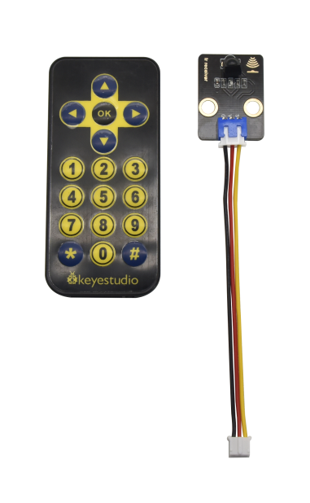**

There is no doubt that infrared remote control is ubiquitous in daily life. It
is used to control various household appliances, such as TVs, stereos, video
recorders and satellite signal receivers. Infrared remote control is composed of
infrared transmitting and infrared receiving systems, that is, an infrared
remote control and infrared receiving module and a single-chip microcomputer
capable of decoding.​

The 38K infrared carrier signal emitted by remote controller is encoded by the
encoding chip in the remote controller. It is composed of a section of pilot
code, user code, user inverse code, data code, and data inverse code. The time
interval of the pulse is used to distinguish whether it is a 0 or 1 signal and
the encoding is made up of these 0, 1 signals.

The user code of the same remote control is unchanged while the data code can
distinguish the key.

When the remote control button is pressed, the remote control sends out an
infrared carrier signal. When the IR receiver receives the signal, the program
will decode the carrier signal and determines which key is pressed. The MCU
decodes the received 01 signal, thereby judging what key is pressed by the
remote control.

Infrared receiver we use is an infrared receiver module. Mainly composed of an
infrared receiver head, which is a device that integrates reception,
amplification, and demodulation. Its internal IC has completed demodulation, and
can achieve from infrared reception to output and be compatible with TTL
signals. Additionally, it is suitable for infrared remote control and infrared
data transmission. The infrared receiving module made by the receiver has only
three pins, signal line, VCC and GND. It is very convenient to communicate with
Arduino and other microcontrollers.

1. Parameters:

Operating Voltage: 3.3-5V（DC）

Interface: 3PIN

Output Signal: Digital signal

Receiving Angle: 90 degrees

Frequency: 38khz

Receiving Distance: 10m

(3) Components Needed:

| keyestudio V4.0 development board \*1           | Keyestudio 8833 Motor Driver Expansion Board\*1     | Kidsbits Yellow LED Module\*1                         | 3P-3P XH2.54 to 2.54 Dupont Wire（Yellow-Red-Black)\*1 |
| ----------------------------------------------- | --------------------------------------------------- | ----------------------------------------------------- | ----------------------------------------------------- |
|  |  |       |       |
| USB Cable\*1                                    | Tank Robot Chassis                                  | Keyestudio JMFP-4 17-Key Remote Control\*1            |                                                       |
|  |     | **** |                                                       |

(4) Test Code:

You need to import the IR library first.

/\*

Keyestudio Mini Tank Robot V3 (Popular Edition)

lesson 9.1

IRremote

http://www.keyestudio.com

\*/

\#include \<IRremote.h\> // IRremote library statement

int RECV_PIN = 3; //define the pins of IR receiver as 3

IRrecv irrecv(RECV_PIN);

decode_results results; //decode results exist in the“result” of “decode results

void setup() {

Serial.begin(9600);

irrecv.enableIRIn(); //Enable receiver

}

void loop() {

if (irrecv.decode(&results))//decode successfully, receive a set of infrared
signals

{

Serial.println(results.value, HEX);//Wrap word in 16 HEX to output and receive
code

irrecv.resume(); //Receive the next value

}

delay(100);

}

\*

1. Test Results：

Upload test code, open serial monitor and set baud rate to 9600, point remote
control to IR receiver. Then the corresponding value will be shown. If holding
down keys for a while, the error codes will appear.

Below we have listed out each button value of keyestudio remote control. So you
can keep it for reference.

(4)Connection Diagram：

The IR receiver is connected to D3, so we don’t need to wire up

1. Code Explanation:

**irrecv.enableIRIn():** after enabling IR decoding, the IR signals will be
received, then function“decode()”will check continuously if decode successfully.

**irrecv.decode(&results):** after decoding successfully, this function will
come back to “true”, and keep result in “results”. After decoding a IR signals,
run the resume()function and receive the next signal.

1. Extension Practice:

We decoded the key value of IR remote control. How about controlling LED by the
measured value? We could design an experiment.

Attach an LED to D9, then press the keys of remote control to make LED light on
and off.

/\*

Keyestudio Mini Tank Robot V3 (Popular Edition)

lesson 9.2

IRremote

http://www.keyestudio.com

\*/

\#include \<IRremote.h\> //IRremote statement

int RECV_PIN = 3; //define the pin of LED as pin 3

int LED = 9;

bool flag = 0;

IRrecv irrecv(RECV_PIN);

decode_results results; //decode results exist in the“result” of “decode results

void setup() {

Serial.begin(9600);

pinMode(LED, OUTPUT);//set LED to output

irrecv.enableIRIn(); //Enable receiver

}

void loop() {

if (irrecv.decode(&results)) {

if (results.value == 0xFF02FD & flag == 0) //The above key code, we use the OK
button on the remote control, if you press the OK button

{

digitalWrite(LED, HIGH); //LED on

flag = 1;

}

else if (results.value == 0xFF02FD & flag == 1) //press again

{

digitalWrite(LED, LOW); //LED off

flag = 0;

}

irrecv.resume(); // Receive the next value

}

}

\*

Upload code to development board, press“OK”key on remote control to make LED on
and off.

### Project 10: Bluetooth Remote Control

**(1)Description:**

In the last several decades, Bluetooth has become the most popular wireless
communication module for it is easy to use and has found wide applications in
most devices powered by batteries.

In order to adjust with the time and reality and need the needs of customers,
Bluetooth has been upgraded several times. In recent years, it embraces lots of
transformations in terms of data transfer rate, power consumption of wearable
devices and IoT devices, and security systems and others. Here, we plan to learn
about DX-BT24 with Arduino board.

**(2) Parameter**

Bluetooth Protocol: Bluetooth Specification V5.1 BLE

Serial port sending and receiving without byte limit

Communication distance: 40m (open environment)

Operating frequency: 2.4GHz ISM band

Modulation method: GFSK (Gaussian Frequency Shift Keying)

Security Features: Authentication and Encryption

Support Services: Central and Peripheral UUIDs FFE0, FFE1, FFE2

Power consumption: automatic sleep mode, standby current 400uA\~800uA, 8.5mA
during transmission.

Power supply: 5V

Operating temperature: –10 to +65 degrees Celsius

(3) Application

| keyestudio V4.0 development board \*1              | Keyestudio  8833 Motor Driver Expansion Board\*1    | Yellow LED Module\*1                             | 3P-3P XH2.54 to 2.54 Dupont Wire（Yellow-Red-Black) |
| -------------------------------------------------- | --------------------------------------------------- | ------------------------------------------------ | -------------------------------------------------- |
|     |  |  |    |
| DX-BT24 V5.1 BLE BT Module\*1                      | USB Cable\*1                                        |                                                  |                                                    |
|  |      |                                                  |                                                    |

(4)Connection Diagram：

1.STATE is the status test pin connected to the internal light-emitting diode
and usually remains unconnected.

2.RXD is the serial port interface for receiving terminal.

3.TXD is the serial port interface for sending terminal.

4.GND is for ground.

5.VCC is the positive pole.

6.EN/BRK: the disconnection of it represents the disconnection of the Bluetooth
and it usually remains unconnected.

(Note: here the Bluetooth is directly linked with the V2 shield and please pay
attention to the direction)

（5）Test Code:

/\*

Keyestudio Mini Tank Robot V3 (Popular Edition)

lesson 10.1

Bluetooth

http://www.keyestudio.com

\*/

char ble_val; //Character variable(used to store the value received by
Bluetooth)

void setup() {

Serial.begin(9600);

}

void loop() {

if (Serial.available() \> 0) //Determine whether there is data in the serial
port buffer

{

ble_val = Serial.read(); //Read the data in the serial port buffer

Serial.println(ble_val); //Print out

}

}

//\*\*\*

(Note: Do not connect the Bluetooth module before uploading the code, because
the uploading of the code also uses serial communication, and there may be
conflicts with the serial communication of the Bluetooth, which can cause the
uploading of the code to fail.)

Upload the code to the development board, then plug in the Bluetooth module, and
then wait for the instructions from the mobile phone.

（6）Download APP：

IOS system

1. Open App Store

2. Search KeyesRobot and download

1. Open Motorhome then select Tank Robot

1. Enable the BT of your cellphone and click **Bluetooth** in the upper right
   corner

You need to open the location access.

5\. Select TANK ROBOT

**Android System**

1. Go to Google Play to search KeyesRobot, or open the following link：

<https://play.google.com/store/apps/details?id=com.keyestudio.motorhome、>https://play.google.com/store/apps/details?id=com.keyestudio.keyestudio

Download it

Click the above icon to select TANK ROBOT and enable“location and Bluetooth”to
pair the Bluetooth。

Scan Bluetooth device. The Bluetooth name of BLE 5.1 is BT24.

The BLE 5.1 Bluetooth has no pairing password

Upload the code, connect the BT and power up. The LED on the BT module will
flash.

Enable the BT of your cellphone and click **Bluetooth** in the upper right
corner

Select BT24 and click Connect. You need to wait for 3-5s after connection.

1. Then LED of the BT module will be solid on

Connect the BT module and open serial monitor and set baud rate to 9600.

Point at the BT module and press keys on the app, then we can see the
corresponding characters of the App.

Remove the BT module before uploading the code, otherwise the code may not be
burned. And we need to enable GPS when connecting the T module

1. **Code Explanation**

**Serial.available()** represents the number of characters currently remaining
in the serial port buffer. This function is generally used to determine whether
there is data in this area. When Serial.available()\>0, it means that the serial
port has received data and can be read.

**Serial.read()** refers to taking out and reading a Byte of data from the
serial port buffer. For example, if a device sends data to the Arduino through
the serial port, we can use Serial.read() to read the sent data.

**(8)Expansion Project**

Here we use the command sent by the mobile phone to turn on or off an LED light.
Looking at the wiring diagram, an LED is connected to the D9 pin,

/\*

Keyestudio Mini Tank Robot V3 (Popular Edition)

lesson 10.2

Bluetooth

http://www.keyestudio.com

\*/

int LED = 9;

char ble_val; //Integer variable used to store the value received by Bluetooth

void setup() {

Serial.begin(9600);

pinMode(LED, OUTPUT);

}

void loop() {

if (Serial.available() \> 0) //Determine whether there is data in the serial
port buffer

{

ble_val = Serial.read(); //Read data from serial port buffer

Serial.print("DATA RECEIVED:");

Serial.println(ble_val);

if (ble_val == 'a') {

digitalWrite(LED, HIGH);

Serial.println("led on");

}

if (ble_val == 'b') {

digitalWrite(LED, LOW);

Serial.println("led off");

}

}

}

//\*\*\*

Click  to control the LED. When
clicking it, a character a will be sent, then LED will be on. If this button is
pressed again, the LED will be off.

You need to remove the BT module if you finish projects.

 

### Project 11: Motor Driving and Speed Control

**(1)Description:**

There are many ways to drive motors. Our smart car uses the most common solution
called L298P. L298P, produced by STMicroelectronics, is an excellent driving
chip specially designed for driving high-power motors . It can directly drive DC
motors, two-phase and four-phase motors with the driving current reaching 2A.
And the motor’s output terminal adopts 8 high-speed Schottky diodes as
protection. We have designed an expansion board based on the L298P circuit of
which the laminated design can be directly plugged into the UNO R3 board for use
reducing the technical difficulties for users in using and driving the motor.

Stack the expansion board on the board, power the BAT , turn the DIP switch to
the ON end, and power the expansion board and the UNO R3 board at the same time
via external power supply. In order to facilitate wiring, the expansion board is
equipped with anti-reverse interface (PH2.0 -2P -3P -4P -5P) and thus it can be
directly plug with motors, power supply, and sensors /modules. The Bluetooth
interface of the drive expansion board is fully compatible with the Keyestudio
HM-10 Bluetooth module. Therefore, we only need to insert the HM-10 Bluetooth
module into the corresponding interface when connecting. At the same time, the
drive extension board also uses 2.54 pin headers to extend out some available
digital ports and analog ports, so that you can continue to add other sensors
and carry out expansion experiments.

The expansion board can be connected to 4 DC motors. In the default jumper cap
connection mode, the A and A1, B and B1 interface motors are connected in
parallel, and their motion pattern is the same. 8 jumper caps can be used to
control the rotation direction of the 4 motor interfaces. For example, when the
two jumper caps in front of the motor A interface are changed from a horizontal
connection to a vertical connection, the rotation direction of the motor A now
is opposite to the original rotation direction.

**(2) Parameters：**

- Logic part input voltage: DC 5V

- Driving part input voltage: DC 7-12V

- Logic part working current: ≤36mA

- Driving part working current: ≤ 2A

- Maximum dissipation power: 25W (T=75℃)

- Control signal input level:
  
  High level: 2.3V ≤ Vin ≤ 5V
  
  Low level: 0V ≤ Vin ≤ 1.5V

- Working temperature: -25℃～＋130℃

**(3) Drive the robot to move**

The direction pin of A motor is D2, the speed control pin is D5; the direction
pin of B motor is in D4 and the speed control pin is D6,

According to the table below, we can know how to control the movement of the
robot by controlling the rotation of two motors through the digital ports and
PWM ports . Among them, the range of PWM value is 0-255. The larger the value
is, the faster the motor rotates.

| Function     | D4   | D6（PWM） | Motor （left）B | D2   | D5（PWM） | Motor（Right）A |
| ------------ | ---- | ------- | ------------- | ---- | ------- | ------------- |
| Move Forward | HIGH | 255-200 | Rotate Left   | HIGH | 255-200 | Rotate Left   |
| Go Back      | LOW  | 200     | Rotate Right  | LOW  | 200     | Rotate Right  |
| Rotate Left  | LOW  | 200     | Rotate Right  | HIGH | 255-200 | Rotate Left   |
| Rotate Right | HIGH | 255-200 | Rotate Left   | LOW  | 200     | Rotate Right  |
| Stop         | LOW  | 0       | Stop          | LOW  | 0       | Stop          |

(5) Components Required

| keyestudio V4.0 development board \*1           | Keyestudio 8833 Motor Driver Expansion Board\*1     | Tank Robot Chassis                               | USB Cable\*1                                    |
| ----------------------------------------------- | --------------------------------------------------- | ------------------------------------------------ | ----------------------------------------------- |
|  |  |  |  |

**(6)Connection Diagram:**

Note:

The 4-pinconnector is marked with A, A1, B1 and B. The right rear motor is
connected to B of the 8833 board and left front one is connected to A port.

（6）Test Code:

/\*

Keyestudio Mini Tank Robot V3 (Popular Edition)

lesson 11.1

motor driver

http://www.keyestudio.com

\*/

\#define ML_Ctrl 4 //Define the direction control pin of the left motor

\#define ML_PWM 6 //Define the PWM control pin of the left motor

\#define MR_Ctrl 2 //Define the direction control pin of the right motor

\#define MR_PWM 5 //Define the PWM control pin of the right motor

void setup()

{

pinMode(ML_Ctrl, OUTPUT);//Define the direction control pin of the left motor as
OUTPUT

pinMode(ML_PWM, OUTPUT);//Define the PWM control pin of the left motor as OUTPUT

pinMode(MR_Ctrl, OUTPUT);//Define the direction control pin of the right motor
as OUTPUT

pinMode(MR_PWM, OUTPUT);//Define the PWM control pin of the right motor as
OUTPUT

}

void loop()

{

//front

digitalWrite(ML_Ctrl, HIGH); //Set direction control speed of the left motor to
HIGH

analogWrite(ML_PWM, 55); //PWM control speed of the left motor is 200

digitalWrite(MR_Ctrl, HIGH); //Set direction control speed of the right motor to
HIGH

analogWrite(MR_PWM, 55); //PWM control speed of the right motor is 200

delay(2000);//delay in 2s

//back

digitalWrite(ML_Ctrl, LOW); //Set direction control speed of the left motor to
LOW

analogWrite(ML_PWM, 200); //PWM control speed of the left motor is 200

digitalWrite(MR_Ctrl, LOW); //Set direction control speed of the right motor to
LOW

analogWrite(MR_PWM, 200); //PWM control speed of the right motor is 200

delay(2000);//delay in 2s

//turn left

digitalWrite(ML_Ctrl, LOW); //Set direction control speed of the left motor to
LOW

analogWrite(ML_PWM, 200); //PWM control speed of the left motor is 200

digitalWrite(MR_Ctrl, HIGH); //Set direction control speed of the right motor to
HIGH

analogWrite(MR_PWM, 55); //PWM control speed of the right motor is 200

delay(2000);//delay in 2s

//turn right

digitalWrite(ML_Ctrl, HIGH); //Set direction control speed of the left motor to
HIGH

analogWrite(ML_PWM, 55); //PWM control speed of the left motor is 200

digitalWrite(MR_Ctrl, LOW); //Set direction control speed of the right motor to
LOW

analogWrite(MR_PWM, 200); //PWM control speed of the right motor is 200

delay(2000);//delay in 2s

//stop

digitalWrite(ML_Ctrl, LOW);

analogWrite(ML_PWM, 0); //PWM control speed of the left motor is 0

digitalWrite(MR_Ctrl, LOW);

analogWrite(MR_PWM, 0); //PWM control speed of the right motor is 0

delay(2000);//delay in 2s

}

//\*

1. **Test Results:**

After wiring according to the diagram, uploading the test code and powering it
up, the smart car moves forward for 2s, steps back for 2s, turns left for 2s,
turns right for 2s and stops for 2s and repeats this sequence.

1. **Code Explanation**

**digitalWrite(ML_Ctrl,LOW);**

The change between high and low levels can makes motors to rotate clockwise or
anticlockwise. General digital pins can be used to control these movements.

**analogWrite(ML_PWM,200);**

The speed adjustment of the motor is realized by PWM, and the pin that controls
the speed of the motor must be the PWM pin of Arduino.

**(10)Expansion Project:**

We adjust the speed of motors by controlling PWM and the wiring remains the
same.

/\*

Keyestudio Mini Tank Robot V3 (Popular Edition)

lesson 11.2

motor driver pwm

http://www.keyestudio.com

\*/

\#define ML_Ctrl 4 //Define the direction control pin of the left motor

\#define ML_PWM 6 //Define the PWM control pin of the left motor

\#define MR_Ctrl 2 //Define the direction control pin of the right motor

\#define MR_PWM 5 //Define the PWM control pin of the right motor

void setup() {

pinMode(ML_Ctrl, OUTPUT);//Define the direction control pin of the left motor as
OUTPUT

pinMode(ML_PWM, OUTPUT);//Define the PWM control pin of the left motor as OUTPUT

pinMode(MR_Ctrl, OUTPUT);//Define the direction control pin of the right motor
as OUTPUT

pinMode(MR_PWM, OUTPUT);//Define the PWM control pin of the right motor as
OUTPUT

}

void loop() {

//front

digitalWrite(ML_Ctrl, HIGH); //Set direction control speed of the left motor to
HIGH

analogWrite(ML_PWM, 155); //PWM control speed of the left motor is 100

digitalWrite(MR_Ctrl, HIGH); //Set direction control speed of the right motor to
HIGH

analogWrite(MR_PWM, 155); //PWM control speed of the right motor is 100

delay(2000);//delay in 2s

//back

digitalWrite(ML_Ctrl, LOW); //Set direction control speed of the left motor to
LOW

analogWrite(ML_PWM, 100); //PWM control speed of the left motor is 100

digitalWrite(MR_Ctrl, LOW); //Set direction control speed of the right motor to
LOW

analogWrite(MR_PWM, 100); //PWM control speed of the right motor is 100

delay(2000);//delay in 2s

//left

digitalWrite(ML_Ctrl, LOW); //Set direction control speed of the left motor to
LOW

analogWrite(ML_PWM, 100); //PWM control speed of the left motor is 100

digitalWrite(MR_Ctrl, HIGH); //Set direction control speed of the right motor to
HIGH

analogWrite(MR_PWM, 155); //PWM control speed of the right motor is 100

delay(2000);//delay in 2s

//right

digitalWrite(ML_Ctrl, HIGH); //Set direction control speed of the left motor to
HIGH

analogWrite(ML_PWM, 155); //PWM control speed of the left motor is 100

digitalWrite(MR_Ctrl, LOW); //Set direction control speed of the right motor to
LOW

analogWrite(MR_PWM, 100); //PWM control speed of the right motor is 100

delay(2000);//delay in 2s

//stop

digitalWrite(ML_Ctrl, LOW); //Set direction control speed of the left motor to
LOW

analogWrite(ML_PWM, 0); //PWM control speed of the left motor is 0

digitalWrite(MR_Ctrl, LOW); //Set direction control speed of the right motor to
LOW

analogWrite(MR_PWM, 0); //PWM control speed of the right motor is 0

delay(2000);//delay in 2s

}

\*\*

Upload the code, the speed of the motor is slower.

Low current will cause the motor to rotate slowly.

### Project 12: 8*16 Facial Expression LED Dot Matrix

**(1)Description:**

Won’t it be fun if a expression board is added to the robot? And the Keyestudio
8\*16 LED dot matrix can do the trick. With the help of it, you could design
facial expressions, images, patterns and other displays by yourselves.

The 8\*16 LED board comes with 128 LEDs. The data of the microprocessor
(Arduino) communicates with the AiP1640 through a two-wire bus interface.
Therefore, it can control the on and off of 128 LEDs on the module, so as to
make the dot matrix on the module to display the pattern you need. A HX-2.54
4Pin cable is provided for your convenience of wiring.

(2) Parameters：

- Working voltage: DC 3.3-5V

- Power loss: 400mW

- Oscillation frequency: 450KHz

- Drive current: 200mA

- Working temperature: -40\~80℃

- Communication mode: two-wire bus

| keyestudio V4.0 development board \*1           | Keyestudio 8833 Motor Driver Expansion Board\*1     | keyestudio 8x16 LED Panel\*1                    | 4P HX-2.54 Dupont Wire (Black-Red-White-Brown)   |
| ----------------------------------------------- | --------------------------------------------------- | ----------------------------------------------- | ------------------------------------------------ |
|  |  |  |  |
| USB Cable\*1                                    |                                                     |                                                 |                                                  |
|  |                                                     |                                                 |                                                  |

1. Components Required

**Principle of the 8\*16 LED dot matrix**

How to control each LED of the 8\*16 dot matrix? It is known that each byte has
8 bits and each bit is 0 or 1. when it is 0, LED is off while when it is 1 LED
is on. One byte can control one column of the LED,and naturally 16 bytes can
control 16 columns of LEDs, that’s the 8\*16 dot matrix.

**Pins description and communication protocol**

The data of the microprocessor (Arduino) communicates with the AiP1640 through a
two-wire bus cable.

The communication protocol diagram is as follows (SCLK) is SCL, (DIN) is SDA

①The starting condition for data input: SCL is high level and SDA changes from
high to low.

②For data command setting, there are methods as shown in the figure below

In our sample program, select the way to **add 1 to the address automatically**,
the binary value is 0100 0000 and the corresponding hexadecimal value is 0x40

|  |
| ----------------------------------------------- |

③For address command setting, the address can be selected as shown below.

The first 00H is selected in our sample program, and the binary number 1100 0000
corresponds to the hexadecimal 0xc0

|  |
| ----------------------------------------------- |

④The requirement for data input is that when SCL is at high level when inputting
data, the signal on SDA must remain unchanged. Only when the clock signal on SCL
is at low level, can the signal on SDA be changed. The input of data is the low
bit first, and the high bit later.

⑤The condition for the end of data transmission is that when SCL is at low
level, SDA at low level and SCL at high level, the level of SDA becomes high.

⑥Display control, set different pulse width, pulse width can be selected as
shown in the figure below

In the example, the pulse width is 4/16, and the hexadecimal corresponding to
1000 1010 is 0x8A

|  |
| ----------------------------------------------- |

4\. Instructions for the use of modulus tool

The dot matrix tool uses the online version, and the link is :
http://dotmatrixtool.com/\#

①Enter the link and the page appears as shown below

②The dot matrix is 8\*16, so adjust the height to 8 and width to 16, as shown in
the figure below

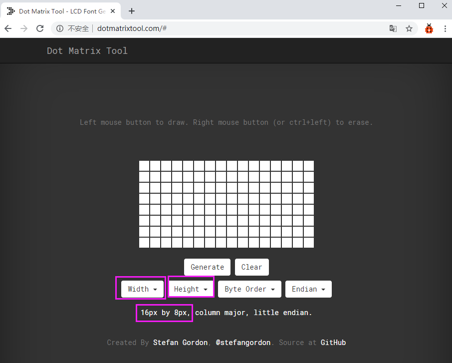

③Generate hexadecimal data from the pattern

As shown in the figure below, press the left mouse button to select, right click
to cancel; draw the pattern you want, click Generate, and the hexadecimal data
we need will be generated.

**(5)Connection Diagram:**

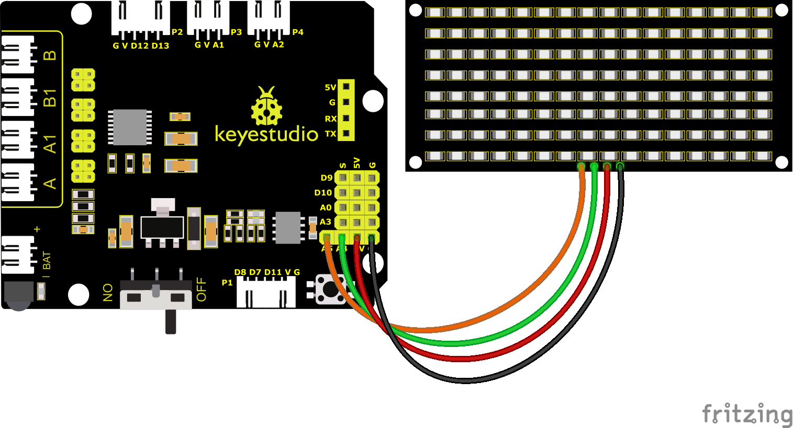

The GND, VCC, SDA, and SCL of the 8x16 LED light board are respectively
connected to the keyestudio sensor expansion board-(GND), + (VCC), A4, A5 for
two-wire serial communication.

(Note: though it is connected with the IIC pin of Arduino, this module is not
for IIC communication. And the IO port here is to simulate I2C communication and
can be connected with any two pins )

(6) Test Code

The code to show the smile face

/\*

Keyestudio Mini Tank Robot V3 (Popular Edition)

lesson 12.1

Matrix face

http://www.keyestudio.com

\*/

//get the data of smile image from a modulus tool

unsigned char smile[] = {0x00, 0x00, 0x1c, 0x02, 0x02, 0x02, 0x5c, 0x40, 0x40,
0x5c, 0x02, 0x02, 0x02, 0x1c, 0x00, 0x00};

\#define SCL_Pin A5 //set a pin of clock to A5

\#define SDA_Pin A4 //set a data pin to A4

void setup() {

//set the pin to OUTPUT

pinMode(SCL_Pin, OUTPUT);

pinMode(SDA_Pin, OUTPUT);

//clear screen

//matrix_display(clear);

}

void loop() {

matrix_display(smile); //display the smile image

}

//this function is used for the display of dot matrix

void matrix_display(unsigned char matrix_value[])

{

IIC_start(); //use the function to start transmitting data

IIC_send(0xc0); //select an address

for (int i = 0; i \< 16; i++) //image data have 16 characters

{

IIC_send(matrix_value[i]); //data to transmit pictures

}

IIC_end(); //end the data transmission of pictures

IIC_start();

IIC_send(0x8A); //show control and select pulse width 4/16

IIC_end();

}

//the condition that data starts transmitting

void IIC_start()

{

digitalWrite(SDA_Pin, HIGH);

digitalWrite(SCL_Pin, HIGH);

delayMicroseconds(3);

digitalWrite(SDA_Pin, LOW);

delayMicroseconds(3);

digitalWrite(SCL_Pin, LOW);

}

//the sign that transmission of data ends

void IIC_end()

{

digitalWrite(SCL_Pin, LOW);

digitalWrite(SDA_Pin, LOW);

delayMicroseconds(3);

digitalWrite(SCL_Pin, HIGH);

delayMicroseconds(3);

digitalWrite(SDA_Pin, HIGH);

delayMicroseconds(3);

}

//transmit data

void IIC_send(unsigned char send_data)

{

for (byte mask = 0x01; mask != 0; mask \<\<= 1) //each character has 8 digits,
which is detected one by one

{

if (send_data & mask) { //set high or low levels in light of each bit(0 or 1)

digitalWrite(SDA_Pin, HIGH);

} else {

digitalWrite(SDA_Pin, LOW);

}

delayMicroseconds(3);

digitalWrite(SCL_Pin, HIGH); //pull up the clock pin SCL_Pin to end the
transmission of data

delayMicroseconds(3);

digitalWrite(SCL_Pin, LOW); //pull down the clock pin SCL_Pin to change signals
of SDA

}

}

**(7 )Test Results:**

After uploading the test code successfully, connecting according to the wiring
diagram, dialing the DIP switch to the right end and powering it on, a
smile-shaped pattern shows on the dot matrix.

**(8)Expansion Project:**

We use the modulus tool we just learned, http://dotmatrixtool.com/\#, to make
the dot matrix display the pattern start , going forward, and stop and then
clear the pattern. The time interval is 2000 ms.

|  |  |  |
| ----------------------------------------------- | ----------------------------------------------- | ----------------------------------------------- |

**Code obtained from the module tool：**

**Code for the pattern start:**

0x01,0x02,0x04,0x08,0x10,0x20,0x40,0x80,0x80,0x40,0x20,0x10,0x08,0x04,0x02,0x01

**Code for the pattern going forward:**

0x00,0x00,0x00,0x00,0x00,0x24,0x12,0x09,0x12,0x24,0x00,0x00,0x00,0x00,0x00,0x00

**Code for the pattern stepping back:**

0x00,0x00,0x00,0x00,0x00,0x24,0x48,0x90,0x48,0x24,0x00,0x00,0x00,0x00,0x00,0x00

**Code for the pattern turning left：**

0x00,0x00,0x00,0x00,0x00,0x00,0x44,0x28,0x10,0x44,0x28,0x10,0x44,0x28,0x10,0x00

**Code for the pattern turning right：**

0x00,0x10,0x28,0x44,0x10,0x28,0x44,0x10,0x28,0x44,0x00,0x00,0x00,0x00,0x00,0x00

**Code for the pattern stop：**

0x2E,0x2A,0x3A,0x00,0x02,0x3E,0x02,0x00,0x3E,0x22,0x3E,0x00,0x3E,0x0A,0x0E,0x00

**Code to clear screen：**

0x00,0x00,0x00,0x00,0x00,0x00,0x00,0x00,0x00,0x00,0x00,0x00,0x00,0x00,0x00,0x00

/\*

keyestudio Mini Tank Robot V3 (Popular Edition)

lesson 12.2

Matrix face

http://www.keyestudio.com

\*/

//Array, used to save data of images, can be calculated by yourself or gotten
from modulus tool

unsigned char start01[] = {0x01, 0x02, 0x04, 0x08, 0x10, 0x20, 0x40, 0x80, 0x80,
0x40, 0x20, 0x10, 0x08, 0x04, 0x02, 0x01};

unsigned char front[] = {0x00, 0x00, 0x00, 0x00, 0x00, 0x24, 0x12, 0x09, 0x12,
0x24, 0x00, 0x00, 0x00, 0x00, 0x00, 0x00};

unsigned char back[] = {0x00, 0x00, 0x00, 0x00, 0x00, 0x24, 0x48, 0x90, 0x48,
0x24, 0x00, 0x00, 0x00, 0x00, 0x00, 0x00};

unsigned char left[] = {0x00, 0x00, 0x00, 0x00, 0x00, 0x00, 0x44, 0x28, 0x10,
0x44, 0x28, 0x10, 0x44, 0x28, 0x10, 0x00};

unsigned char right[] = {0x00, 0x10, 0x28, 0x44, 0x10, 0x28, 0x44, 0x10, 0x28,
0x44, 0x00, 0x00, 0x00, 0x00, 0x00, 0x00};

unsigned char STOP01[] = {0x2E, 0x2A, 0x3A, 0x00, 0x02, 0x3E, 0x02, 0x00, 0x3E,
0x22, 0x3E, 0x00, 0x3E, 0x0A, 0x0E, 0x00};

unsigned char clear[] = {0x00, 0x00, 0x00, 0x00, 0x00, 0x00, 0x00, 0x00, 0x00,
0x00, 0x00, 0x00, 0x00, 0x00, 0x00, 0x00};

\#define SCL_Pin A5 //set a pin of clock to A5

\#define SDA_Pin A4 //set a data pin to A4

void setup() {

//set the pin to OUTPUT

pinMode(SCL_Pin, OUTPUT);

pinMode(SDA_Pin, OUTPUT);

//clear screen

matrix_display(clear);

}

void loop() {

matrix_display(start01); //show "Start" image

delay(2000);

matrix_display(front); //show "front" image

delay(2000);

matrix_display(STOP01); //show "STOP01" image

delay(2000);

matrix_display(clear); //show "clear" image

delay(2000);

}

//this function is used for the display of dot matrix

void matrix_display(unsigned char matrix_value[])

{

IIC_start(); //use the function to start transmitting data

IIC_send(0xc0); //select an address

for (int i = 0; i \< 16; i++) //image data have 16 characters

{

IIC_send(matrix_value[i]); //data to transmit pictures

}

IIC_end(); //end the data transmission of pictures

IIC_start();

IIC_send(0x8A); //show control and select pulse width 4/16

IIC_end();

}

//the condition that data starts transmitting

void IIC_start()

{

digitalWrite(SDA_Pin, HIGH);

digitalWrite(SCL_Pin, HIGH);

delayMicroseconds(3);

digitalWrite(SDA_Pin, LOW);

delayMicroseconds(3);

digitalWrite(SCL_Pin, LOW);

}

//the sign that transmission of data ends

void IIC_end()

{

digitalWrite(SCL_Pin, LOW);

digitalWrite(SDA_Pin, LOW);

delayMicroseconds(3);

digitalWrite(SCL_Pin, HIGH);

delayMicroseconds(3);

digitalWrite(SDA_Pin, HIGH);

delayMicroseconds(3);

}

//transmit data

void IIC_send(unsigned char send_data)

{

for (byte mask = 0x01; mask != 0; mask \<\<= 1) //each character has 8 digits,
which is detected one by one

{

if (send_data & mask) { //set high or low levels in light of each bit(0 or 1)

digitalWrite(SDA_Pin, HIGH);

} else {

digitalWrite(SDA_Pin, LOW);

}

delayMicroseconds(3);

digitalWrite(SCL_Pin, HIGH); //pull up the clock pin SCL_Pin to end the
transmission of data

delayMicroseconds(3);

digitalWrite(SCL_Pin, LOW); //pull down the clock pin SCL_Pin to change signals
of SDA

}

}

After uploading test code, the facial expression board shows these patterns
orderly and repeats this sequence.

|  |  |  |
|  |

### Project 13: Light Following Tank

**(1)Description**:

（

In previous projects, we introduced in detail the use of various sensors,
modules, and expansion boards on the smart car. Now let’s move to the projects
of the smart car . The light-following smart cars, as the name suggests, is a
smart car that can follow the light.

We can combine the knowledge from projects photoresistor and motor drive to make
a light-seeking smart car. In the project, we use two photoresistor modules to
detect the light intensity on the left and right sides of the smart car, read
the corresponding analog values, and then control the rotation of the two motors
based on these two data so as,to control the movements of the smart car.

The specific logic of the light-following smart car is shown as below.

| Detection (the bigger the brightness,the bigger the value ) | photoresistor module on the left   | left_light  |
| ----------------------------------------------------------- | ---------------------------------- | ----------- |
|                                                             | photoresistor module on the right  | right_light |
| Condition                                                   | left_light＞650 and right_light＞650 |             |
| Movement                                                    | Move forward（set PWM to 200）       |             |
| Condition                                                   | left_light＞650 and right_light≤650 |             |
| Movement                                                    | Rotate left（set PWM to 200）        |             |
| Condition                                                   | left_light≤650 and right_light＞650 |             |
| Movement                                                    | Rotate right（set PWM to 200）       |             |
| Condition                                                   | left_light≤650 and right_light≤650 |             |
| Movement                                                    | stop                               |             |

**(2)Flow chart**

**(3)Connection Diagram:**

Note: The pin "G", "V" and S of the left photoresistor module are connected to G
(GND), V (VCC), A1 respectively;

The pin "G", "V" and S of the right photoresistor module are connected to the G
(GND), V (VCC), and A2 respectively.

**(4)Test Code**

/\*

Keyestudio Mini Tank Robot V3 (Popular Edition)

lesson 13

light follow tank

http://www.keyestudio.com

\*/

\#define light_L_Pin A1 //Define the pin of the photosensitive sensor on the
left

\#define light_R_Pin A2 //Define the pin of the photosensitive sensor on the
right

\#define ML_Ctrl 4 //Define the direction control pin of the left motor

\#define ML_PWM 6 //Define the PWM control pin of the left motor

\#define MR_Ctrl 2 //Define the direction control pin of the right motor

\#define MR_PWM 5 //Define the PWM control pin of the right motor

int left_light;

int right_light;

void setup() {

Serial.begin(9600);

pinMode(light_L_Pin, INPUT);

pinMode(light_R_Pin, INPUT);

pinMode(ML_Ctrl, OUTPUT);

pinMode(ML_PWM, OUTPUT);

pinMode(MR_Ctrl, OUTPUT);

pinMode(MR_PWM, OUTPUT);

}

void loop() {

left_light = analogRead(light_L_Pin);

right_light = analogRead(light_R_Pin);

Serial.print("left_light_value = ");

Serial.println(left_light);

Serial.print("right_light_value = ");

Serial.println(right_light);

if (left_light \> 650 && right_light \> 650) //go front

{

Car_front();

}

else if (left_light \> 650 && right_light \<= 650) //turn left

{

Car_left();

}

else if (left_light \<= 650 && right_light \> 650) //turn right

{

Car_right();

}

else //otherwise, stop

{

Car_Stop();

}

}

void Car_front()

{

digitalWrite(MR_Ctrl, HIGH);

analogWrite(MR_PWM, 55);

digitalWrite(ML_Ctrl, HIGH);

analogWrite(ML_PWM, 55);

}

void Car_left()

{

digitalWrite(MR_Ctrl, HIGH);

analogWrite(MR_PWM, 55);

digitalWrite(ML_Ctrl, LOW);

analogWrite(ML_PWM, 200);

}

void Car_right()

{

digitalWrite(MR_Ctrl, LOW);

analogWrite(MR_PWM, 200);

digitalWrite(ML_Ctrl, HIGH);

analogWrite(ML_PWM, 55);

}

void Car_Stop()

{

digitalWrite(MR_Ctrl, LOW);

analogWrite(MR_PWM, 0);

digitalWrite(ML_Ctrl, LOW);

analogWrite(ML_PWM, 0);

}

1. Test Result

After uploading the test code successfully, connecting according to the wiring
diagram, dialing the DIP switch to the right end and powering it on, the smart
car follows the light to move.（5）

### Project 14: Ultrasonic Following Tank

**(1)Description:**

In the previous lesson, we learned about the light-following smart car. And in
this lesson, we can combine the knowledge to make an ultrasonic sound-following
car. In the project, we use ultrasonic sensors to detect the distance between
the car and the obstacle in front, and then control the rotation of the two
motors based on this data so as to control the movements of the smart car.

The specific logic of the ultrasonic sound- following smart car is shown in the
table below:

| Detection | The distance between the car and the obstacle front | Distance （unit：cm） |
| --------- | --------------------------------------------------- | ------------------ |
| Setting   | Set the angle of the servo to 90°                   |                    |
| Condition | distance≥20 and distance≤50                         |                    |
| Movement  | go front                                            |                    |
| Condition | distance＞10 and distance＜20                         |                    |
|           | distance＞50                                         |                    |
| Movement  | Stop                                                |                    |
| Condition | distance≤10                                         |                    |
| Movement  | go back                                             |                    |

**(2)Flow chart**

**(3)Connection Diagram:**

**(4)Test Code**

/\*

Keyestudio Mini Tank Robot V3 (Popular Edition)

lesson 14

Ultrasonic follow tank

http://www.keyestudio.com

\*/

\#define servoPin 10 //The pin of servo

\#define ML_Ctrl 4 //Define the direction control pin of the left motor

\#define ML_PWM 6 //Define the PWM control pin of the left motor

\#define MR_Ctrl 2 //Define the direction control pin of the right motor

\#define MR_PWM 5 //Define the PWM control pin of the right motor

\#define Trig 12

\#define Echo 13

float distance;

void setup() {

pinMode(servoPin, OUTPUT);

pinMode(Trig, OUTPUT);

pinMode(Echo, INPUT);

pinMode(ML_Ctrl, OUTPUT);

pinMode(ML_PWM, OUTPUT);

pinMode(MR_Ctrl, OUTPUT);

pinMode(MR_PWM, OUTPUT);

procedure(90); //Set the angle of the servo to 90°

delay(500); //delay in 500ms

}

void loop() {

distance = checkdistance(); //Assign the distance measured by ultrasonic sound
to distance

if (distance \>= 20 && distance \<= 50) //go front

{

Car_front();

}

else if (distance \> 10 && distance \< 20) //stop

{

Car_Stop();

}

else if (distance \<= 10) //go back

{

Car_back();

}

else //In other conditions, it stops

{

Car_Stop();

}

}

void Car_front()

{

digitalWrite(MR_Ctrl, HIGH);

analogWrite(MR_PWM, 55);

digitalWrite(ML_Ctrl, HIGH);

analogWrite(ML_PWM, 55);

}

void Car_back()

{

digitalWrite(MR_Ctrl, LOW);

analogWrite(MR_PWM, 200);

digitalWrite(ML_Ctrl, LOW);

analogWrite(ML_PWM, 200);

}

void Car_left()

{

digitalWrite(MR_Ctrl, HIGH);

analogWrite(MR_PWM, 55);

digitalWrite(ML_Ctrl, LOW);

analogWrite(ML_PWM, 200);

}

void Car_right()

{

digitalWrite(MR_Ctrl, LOW);

analogWrite(MR_PWM, 200);

digitalWrite(ML_Ctrl, HIGH);

analogWrite(ML_PWM, 55);

}

void Car_Stop()

{

digitalWrite(MR_Ctrl, LOW);

analogWrite(MR_PWM, 0);

digitalWrite(ML_Ctrl, LOW);

analogWrite(ML_PWM, 0);

}

//The function to control servos

void procedure(byte myangle) {

int pulsewidth;

for (int i = 0; i \< 5; i++) {

pulsewidth = myangle \* 11 + 500; //Calculate the value of pulse width
digitalWrite(servoPin, HIGH);

delayMicroseconds(pulsewidth); //The time in high level represents the pulse
width

digitalWrite(servoPin, LOW);

delay((20 - pulsewidth / 1000)); //As the cycle is 20ms, the time left is in low
level

}

}

//The function to control ultrasonic sound

float checkdistance() {

static float distance;

digitalWrite(Trig, LOW);

delayMicroseconds(2);

digitalWrite(Trig, HIGH);

delayMicroseconds(10);

digitalWrite(Trig, LOW);

distance = pulseIn(Echo, HIGH) / 58.20; //The 58.20 here comes from 2\*29.1=58.2

delay(10);

return distance;

}

**(5 )Test Results:**

Upload the test code successfully, wire up, dial the DIP switch to the right
end, power up and set the servo to 9°，the smart car follows the obstacle to
move.

### Project 15: Ultrasonic Obstacle Avoidance Tank

1. **Description:**

In the previous project, we made an ultrasonic sound-following smart car. In
fact, using the same components and the same wiring method, we only need to
change the test code to turn it into an ultrasonic obstacle avoidance smart car.
This smart car can move with the movement of the human hands. We use ultrasonic
sensors to detect the distance between the smart car and the obstacle in front,
and then control the rotation of the two motors based on this data so as to
control the movements of the smart car.

| Detection   | Distance measured by the ultrasonic senor between the car and the obstacle in front （set the angle of the servo to 90°）              | a （unit：cm）        |                                                                                                            |
| ----------- | ------------------------------------------------------------------------------------------------------------------------------------ | ------------------ | ---------------------------------------------------------------------------------------------------------- |
|             | Distance measured by the ultrasonic senor between the car and the obstacle on the right （set the angle of the servo to 20°）          | a2 （unit：cm）       |                                                                                                            |
|             | Distance measured by the ultrasonic senor between the car and the obstacle on the left （set the angle of the servo to 160°）          | a1 （unit：cm）       |                                                                                                            |
| Setting     | set the starting angle of the servo to 90°                                                                                           |                    |                                                                                                            |
| Condition 1 | Movement                                                                                                                             |                    |                                                                                                            |
| a＜20        | Stop for 1000 ms；set the angle of the servo to 160°，read a1，delay in 500ms；set the angle of the servo to 20°，read a2，delay in 500ms. |                    |                                                                                                            |
|             | Condition 2                                                                                                                          | Movement           |                                                                                                            |
|             | a1＜50 or a2＜50                                                                                                                       | Compare a1 with a2 |                                                                                                            |
|             |                                                                                                                                      | Condition 3        | Movement                                                                                                   |
|             |                                                                                                                                      | a1＞a2              | Set the angle of the servo to 90°，rotate left for 500ms（set PWM to 255），and move forward（set PWM to 200）.  |
|             |                                                                                                                                      | a1＜a2              | Set the angle of the servo to 90°，rotate right for 500ms（set PWM to 255），and move forward（set PWM to 200）. |
|             | Condition 2                                                                                                                          | Movement           |                                                                                                            |
|             | a1≥50 and a2≥50                                                                                                                      | Random             | set the angle of the servo to 90°，rotate left for 500ms（set PWM to 255），and move forward（set PWM to 200）.  |
|             |                                                                                                                                      |                    | set the angle of the servo to 90°，rotate right for 500ms（set PWM to 255），and move forward（set PWM to 200）. |
| Condition 2 | Movement                                                                                                                             |                    |                                                                                                            |
| a≥20        | move forward（set PWM to 200）                                                                                                         |                    |                                                                                                            |

The specific logic of the ultrasonic obstacle avoidance smart car is shown in
the table below:

**(2)Flow chart**

**(3)Connection Diagram:**

(Note: the“-”,“+”and S pins of the servo are respectively connected to G (GND),
V (VCC) and D10 of the expansion board; and for the ultrasonic sensor,the VCC
pin is connected to the 5v (V) ,the Trig pin to digital 12 (S), the Echo pin to
digital 13 (S), and the Gnd pin to Gnd (G); the same as last project.）

**(4) Test Code**

/\*

Keyestudio Mini Tank Robot V3 (Popular Edition)

lesson 15

Ultrasonic avoid tank

http://www.keyestudio.com

\*/

\#define servoPin 10 //The pin of servo

int a, a1, a2;

\#define ML_Ctrl 4 //Define the direction control pin of the left motor

\#define ML_PWM 6 //Define the PWM control pin of the left motor

\#define MR_Ctrl 2 //Define the direction control pin of the right motor

\#define MR_PWM 5 //Define the PWM control pin of the right motor

\#define Trig 12

\#define Echo 13

float distance;

void setup() {

Serial.begin(9600);

pinMode(servoPin, OUTPUT);

pinMode(Trig, OUTPUT);

pinMode(Echo, INPUT);

pinMode(ML_Ctrl, OUTPUT);

pinMode(ML_PWM, OUTPUT);

pinMode(MR_Ctrl, OUTPUT);

pinMode(MR_PWM, OUTPUT);

procedure(90); //Set the angle of the servo to 90°

delay(500); //delay in 500ms

}

void loop() {

a = checkdistance(); //Assign the distance to the front detected by ultrasonic
sensor to the variable a

if (a \< 20) {//When the distance to the front is less than 20cm

Car_Stop(); //The robot stops

delay(500); //delay in 500ms

procedure(180); //Ultrasonic pan-tilt turns left

delay(500); //delay in 500ms

a1 = checkdistance(); //Assign the distance to the left detected by ultrasonic
sensor to the variable a1

delay(100); //read value

procedure(0); //Ultrasonic pan-tilt turns right

delay(500); //delay in 500ms

a2 = checkdistance(); //Assign the distance to the right detected by ultrasonic
sensor to the variable a2

delay(100); //read value

procedure(90); //Back to 90°

delay(500);

if (a1 \> a2) { //When the distance to the left is bigger than to the right

Car_left(); //The robot turns left

delay(700); //turn left700ms

} else {

Car_right(); //It turns left for 700ms

delay(700);

}

}

else { //When the distance to the front is \>=20c，the robot moves forward

Car_front(); //go front

}

}

void Car_front()

{

digitalWrite(MR_Ctrl, HIGH);

analogWrite(MR_PWM, 55);

digitalWrite(ML_Ctrl, HIGH);

analogWrite(ML_PWM, 55);

}

void Car_back()

{

digitalWrite(MR_Ctrl, LOW);

analogWrite(MR_PWM, 200);

digitalWrite(ML_Ctrl, LOW);

analogWrite(ML_PWM, 200);

}

void Car_left()

{

digitalWrite(MR_Ctrl, HIGH);

analogWrite(MR_PWM, 55);

digitalWrite(ML_Ctrl, LOW);

analogWrite(ML_PWM, 200);

}

void Car_right()

{

digitalWrite(MR_Ctrl, LOW);

analogWrite(MR_PWM, 200);

digitalWrite(ML_Ctrl, HIGH);

analogWrite(ML_PWM, 55);

}

void Car_Stop()

{

digitalWrite(MR_Ctrl, LOW);

analogWrite(MR_PWM, 0);

digitalWrite(ML_Ctrl, LOW);

analogWrite(ML_PWM, 0);

}

//The function controls servos

void procedure(byte myangle) {

int pulsewidth;

for (int i = 0; i \< 5; i++) {

pulsewidth = myangle \* 11 + 500; //Calculate the value of pulse width

digitalWrite(servoPin, HIGH);

delayMicroseconds(pulsewidth); //The time in high level represents the pulse
width

digitalWrite(servoPin, LOW);

delay((20 - pulsewidth / 1000)); //As the cycle is 20ms, the time left is in low
level

}

}

//The function controls ultrasonic sound

float checkdistance() {

float distance;

digitalWrite(Trig, LOW);

delayMicroseconds(2);

digitalWrite(Trig, HIGH);

delayMicroseconds(10);

digitalWrite(Trig, LOW);

distance = pulseIn(Echo, HIGH) / 58.20; //The 58.20 here comes from 2\*29.1=58.2

delay(10);

return distance;

}

(4) Test Result

After upload the test code successfully, wire up, turn the DIP switch to the ON
end, and power up, the smart car moves forward and automatically avoids
obstacles.

### Project 16: Move-in-Confined-Space Tank

**(1)Description:**

The ultrasonic sound-following and obstacle avoidance functions of the smart car
have been introduced in previous projects. Here we intend to combine the
knowledge in the previous courses to confine the smart car to move in a certain
space. In the experiment, we use the line-tracking sensor to detect whether
there is a black line around the smart car, and then control the rotation of the
two motors according to the detection results, so as to lock the smart car in a
circle drawn in black line.

| Detection                                                  | Line-tracking sensor in the middle | Black line detected: in high level |
| ---------------------------------------------------------- | ---------------------------------- | ---------------------------------- |
|                                                            |                                    | White line detected: in low level  |
|                                                            | Line-tracking sensor on the left   | Black line detected: in high level |
|                                                            |                                    | White line detected: in low level  |
|                                                            | Line-tracking sensor on the right  | Black line detected: in high level |
|                                                            |                                    | White line detected: in low level  |
| Condition                                                  | Movement                           |                                    |
| All the three line-tracking sensors detect no black lines  | go front                           |                                    |
| Any of the three line-tracking sensors detects black lines | go back then rotate to left        |                                    |

**(2)Flow chart**

**(3)Connection Diagram:**

**(4)Test Code**

/\*

Keyestudio Mini Tank Robot V3 (Popular Edition)

lesson 16

draw a circle for tank

http://www.keyestudio.com

\*/

//The wiring of line tracking sensor

\#define L_pin 11 //left

\#define M_pin 7 //middle

\#define R_pin 8 //right

\#define ML_Ctrl 4 //Define the direction control pin of the left motor

\#define ML_PWM 6 //Define the PWM control pin of the left motor

\#define MR_Ctrl 2 //Define the direction control pin of the right motor

\#define MR_PWM 5 //Define the PWM control pin of the right motor

int L_val, M_val, R_val;

void setup()

{

Serial.begin(9600); //Set the baud rate to 9600

pinMode(L_pin, INPUT); //Set all pins of the line tracking sensor as input mode

pinMode(M_pin, INPUT);

pinMode(R_pin, INPUT);

pinMode(ML_Ctrl, OUTPUT);

pinMode(ML_PWM, OUTPUT);

pinMode(MR_Ctrl, OUTPUT);

pinMode(MR_PWM, OUTPUT);

}

void loop () {

L_val = digitalRead(L_pin); //Read the value of the left sensor

M_val = digitalRead(M_pin); //Read the value of the middle sensor

R_val = digitalRead(R_pin); //Read the value of the right sensor

if ( L_val == 0 && M_val == 0 && R_val == 0 ) { //when black lines are not
detected, go front

Car_front();

}

else { //black lines are detected, go back then turn left

Car_back();

delay(700);

Car_left();

delay(800);

}

}

void Car_front()

{

digitalWrite(MR_Ctrl, HIGH);

analogWrite(MR_PWM, 100);

digitalWrite(ML_Ctrl, HIGH);

analogWrite(ML_PWM, 100);

}

void Car_back()

{

digitalWrite(MR_Ctrl, LOW);

analogWrite(MR_PWM, 150);

digitalWrite(ML_Ctrl, LOW);

analogWrite(ML_PWM, 150);

}

void Car_left()

{

digitalWrite(MR_Ctrl, HIGH);

analogWrite(MR_PWM, 100);

digitalWrite(ML_Ctrl, LOW);

analogWrite(ML_PWM, 150);

}

void Car_right()

{

digitalWrite(MR_Ctrl, LOW);

analogWrite(MR_PWM, 150);

digitalWrite(ML_Ctrl, HIGH);

analogWrite(ML_PWM, 100);

}

void Car_Stop()

{

digitalWrite(MR_Ctrl, LOW);

analogWrite(MR_PWM, 0);

digitalWrite(ML_Ctrl, LOW);

analogWrite(ML_PWM, 0);

}

**(5 )Test Results:**

After uploading the test code successfully and powering it up, the smart car
moves in a confined space, the circle drawn in black line.

### Project 17: Line-tracking Tank

**(1)Description:**

In 

The previous project has introduced how to confine the smart car to move in a
certain space. In this project, we could use the knowledge learned before to
make it a line-tracking smart car. In the experiment, we use the line-tracking
sensor to detect whether there is a black line around the smart car, and then
control the rotation of the two motors according to the detection results, so as
to make the smart car to move along the black line.

The specific logic of the line-tracking smart car is shown in the table below

| Detection                                                 | Line-tracking sensor in the middle                                                                   | Black line detected: in high level |
| --------------------------------------------------------- | ---------------------------------------------------------------------------------------------------- | ---------------------------------- |
|                                                           |                                                                                                      | White line detected: in low level  |
|                                                           | Line-tracking sensor on the left                                                                     | Black line detected: in high level |
|                                                           |                                                                                                      | White line detected: in low level  |
|                                                           | Line-tracking sensor on the right                                                                    | Black line detected: in high level |
|                                                           |                                                                                                      | White line detected: in low level  |
| Condition                                                 | Movement                                                                                             |                                    |
| Line-tracking sensor in the middle detects the black line | Line-tracking sensor on the left detects the black line and the one on the right detects white lines | Rotate left（set PWM to 200）        |
|                                                           | Line-tracking sensor on the left detects white lines and the one on the right detects the black line | Rotate right（set PWM to 200）       |
|                                                           | Both the left and right line-tracking sensors detect white lines                                     | Move forward                       |
|                                                           | Both the left and right line-tracking sensors detect the black line                                  |                                    |
| Line-tracking sensor in the middle detects white lines    | Line-tracking sensor on the left detects the black line and the one on the right detects white lines | Rotate left（set PWM to 200）        |
|                                                           | Line-tracking sensor on the left detects white lines and the one on the right detects the black line | Rotate right（set PWM to 200）       |
|                                                           | Both the left and right line-tracking sensors detect white lines                                     | Stop                               |
|                                                           | Both the left and right line-tracking sensors detect the black line                                  |                                    |

**(2)Flow chart**

1. Wiring Diagram

**(4) Test Code**

/\*

Keyestudio Mini Tank Robot V3 (Popular Edition)

lesson 17

Line track tank

http://www.keyestudio.com

\*/

//The wiring of line tracking sensor

\#define L_pin 11 //left

\#define M_pin 7 //middle

\#define R_pin 8 //right

\#define ML_Ctrl 4 //Define the direction control pin of the left motor

\#define ML_PWM 6 //Define the PWM control pin of the left motor

\#define MR_Ctrl 2 //Define the direction control pin of the right motor

\#define MR_PWM 5 //Define the PWM control pin of the right motor

int L_val, M_val, R_val;

void setup()

{

Serial.begin(9600); //Set the baud rate to 9600

pinMode(L_pin, INPUT); //Set all pins of the line tracking sensor as input mode

pinMode(M_pin, INPUT);

pinMode(R_pin, INPUT);

pinMode(ML_Ctrl, OUTPUT);

pinMode(ML_PWM, OUTPUT);

pinMode(MR_Ctrl, OUTPUT);

pinMode(MR_PWM, OUTPUT);

}

void loop () {

L_val = digitalRead(L_pin); //Read the value of the left sensor

M_val = digitalRead(M_pin); //Read the value of the middle sensor

R_val = digitalRead(R_pin); //Read the value of the right sensor

if (M_val == 1) { //the middle one detects black lines

if (L_val == 1 && R_val == 0) { //If a black line is detected on the left, but
not on the right, turn left

Car_left();

}

else if (L_val == 0 && R_val == 1) { //If a black line is detected on the right,
not on the left, turn right

Car_right();

}

else { //otherwise, go front

Car_front();

}

}

else { //The middle one doesn't detect black lines

if (L_val == 1 && R_val == 0) { //If a black line is detected on the left, but
not on the right, turn left

Car_left();

}

else if (L_val == 0 && R_val == 1) { //If a black line is detected on the right,
not on the left, turn right

Car_right();

}

else { //otherwise, stop

Car_Stop();

}

}

}

//go front

void Car_front()

{

digitalWrite(MR_Ctrl, HIGH);

analogWrite(MR_PWM, 100);

digitalWrite(ML_Ctrl, HIGH);

analogWrite(ML_PWM, 100);

}

//go back

void Car_back()

{

digitalWrite(MR_Ctrl, LOW);

analogWrite(MR_PWM, 150);

digitalWrite(ML_Ctrl, LOW);

analogWrite(ML_PWM, 150);

}

//turn left

void Car_left()

{

digitalWrite(MR_Ctrl, HIGH);

analogWrite(MR_PWM, 100);

digitalWrite(ML_Ctrl, LOW);

analogWrite(ML_PWM, 150);

}

//turn right

void Car_right()

{

digitalWrite(MR_Ctrl, LOW);

analogWrite(MR_PWM, 150);

digitalWrite(ML_Ctrl, HIGH);

analogWrite(ML_PWM, 100);

}

//stop

void Car_Stop()

{

digitalWrite(MR_Ctrl, LOW);

analogWrite(MR_PWM, 0);

digitalWrite(ML_Ctrl, LOW);

analogWrite(ML_PWM, 0);

}

Test Result

After uploading the test code successfully and powering it up, the smart car
moves along the black line.（5

### Project 18: Fire Extinguishing Tank

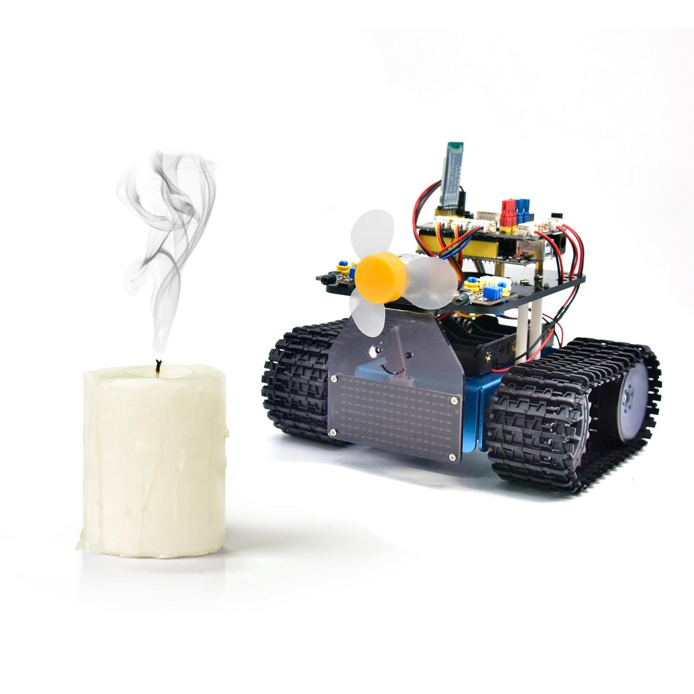

**(1)Description:**

T

The line-tracking function of the smart tank has been explained in the previous
project. And in this project we use the flame sensor to make a fire
extinguishing robot. When the car encounters flames, the motor of the fan will
rotate to blow out the fire. Of course, we need to replace the ultrasonic sensor
and two photoresistors with a fan module and flame sensors first.

The specific logic of the line-tracking smart car is shown in the table below:

| Flame sensors         | Line-tracking sensors | The status of the car and the fan |               |              |                                              |
| --------------------- | --------------------- | --------------------------------- | ------------- | ------------ | -------------------------------------------- |
| On the left           | On the right          | On the left                       | In the middle | On the right | /                                            |
| The analog value ≤700 | The analog value≤700  | /                                 | /             | /            | Stop，turn on the fan                         |
| The analog value\>700 | The analog value\<700 | /                                 | /             | /            | Stop，turn on the fan                         |
| The analog value≤700  | The analog value\>700 | /                                 | /             | /            | Stop，turn on the fan                         |
| The analog value\>700 | The analog value\>700 | /                                 | /             | /            | Turn off the fan and continue following line |

**(2)Flow chart**

**(3)Connection Diagram:**

**(4)Test Code**

/\*

Keyestudio Mini Tank Robot V3 (Popular Edition)

lesson 18

Fire extinguishing tank

http://www.keyestudio.com

\*/

int flame_L = A1; //Define the flame interface on the left as the analog pin A1

int flame_R = A2; //Define the flame interface on the right as the analog pin A2

//The wiring of line tracking sensor

\#define L_pin 11 //left

\#define M_pin 7 //middle

\#define R_pin 8 //right

//The pin of the servo 130

int INA = 12;

int INB = 13;

\#define ML_Ctrl 4 //Define the direction control pin of the left motor

\#define ML_PWM 6 //Define the PWM control pin of the left motor

\#define MR_Ctrl 2 //Define the direction control pin of the right motor

\#define MR_PWM 5 //Define the PWM control pin of the right motor

int L_val, M_val, R_val, flame_valL, flame_valR;

void setup()

{

Serial.begin(9600);

//Set all pins of the line tracking sensor as input mode

pinMode(L_pin, INPUT);

pinMode(M_pin, INPUT);

pinMode(R_pin, INPUT);

//Define the flame as INPUT

pinMode(flame_L, INPUT);

pinMode(flame_R, INPUT);

//Define the motor as OUTPUT

pinMode(ML_Ctrl, OUTPUT);

pinMode(ML_PWM, OUTPUT);

pinMode(MR_Ctrl, OUTPUT);

pinMode(MR_PWM, OUTPUT);

pinMode(INA, OUTPUT);//Set digital port INA as OUTPUT

pinMode(INB, OUTPUT);//Set digital port INB as OUTPUT

}

void loop () {

//Read the analog value of the flame sensors

flame_valL = analogRead(flame_L);

flame_valR = analogRead(flame_R);

Serial.print(flame_valL);

Serial.print(" ");

Serial.print(flame_valR);

Serial.println(" ");

// delay(500);

if (flame_valL \<= 700 \|\| flame_valR \<= 700) {

Car_Stop();

fan_begin();

} else {

fan_stop();

L_val = digitalRead(L_pin); //Read the value of the left sensor

M_val = digitalRead(M_pin); //Read the value of the middle sensor

R_val = digitalRead(R_pin); //Read the value of the right sensor

if (M_val == 1) { //the middle one detects black lines

if (L_val == 1 && R_val == 0) { //If a black line is detected on the left, but
not on the right, turn left

Car_left();

}

else if (L_val == 0 && R_val == 1) { //If a black line is detected on the right,
not on the left, turn right

Car_right();

}

else { //otherwise, go front

Car_front();

}

}

else { //The middle one doesn't detect black lines

if (L_val == 1 && R_val == 0) { //If a black line is detected on the left, but
not on the right, turn left

Car_left();

}

else if (L_val == 0 && R_val == 1) { //If a black line is detected on the right,
not on the left, turn right

Car_right();

}

else { //otherwise, stop

Car_Stop();

}

}

}

}

void fan_stop() {

//stop rotating

digitalWrite(INA, LOW);

digitalWrite(INB, LOW);

}

void fan_begin() {

//fan rotates

digitalWrite(INA, LOW);

digitalWrite(INB, HIGH);

}

void Car_front()

{

digitalWrite(MR_Ctrl, HIGH);

analogWrite(MR_PWM, 150);

digitalWrite(ML_Ctrl, HIGH);

analogWrite(ML_PWM, 150);

}

void Car_back()

{

digitalWrite(MR_Ctrl, LOW);

analogWrite(MR_PWM, 100);

digitalWrite(ML_Ctrl, LOW);

analogWrite(ML_PWM, 100);

}

void Car_left()

{

digitalWrite(MR_Ctrl, HIGH);

analogWrite(MR_PWM, 150);

digitalWrite(ML_Ctrl, LOW);

analogWrite(ML_PWM, 100);

}

void Car_right()

{

digitalWrite(MR_Ctrl, LOW);

analogWrite(MR_PWM, 100);

digitalWrite(ML_Ctrl, HIGH);

analogWrite(ML_PWM, 150);

}

void Car_Stop()

{

digitalWrite(MR_Ctrl, LOW);

analogWrite(MR_PWM, 100);

digitalWrite(ML_Ctrl, LOW);

analogWrite(ML_PWM, 100);

digitalWrite(MR_Ctrl, LOW);

analogWrite(MR_PWM, 0);

digitalWrite(ML_Ctrl, LOW);

analogWrite(ML_PWM, 0);

}

1. Test Result

After uploading the test code successfully and powering it up, the smart car
puts out the fire when it detects flame and continues moving along the black
line.5P

### Project 19: IR Remote Control Tank

**(1)Description:**

Infrared remote control is one of the most common remote control found
applications in electric motors, electric fans, and many other household
appliances. In this project,we use the knowledge we learned before to make an
infrared remote control smart car.

In the 9th lesson, we have tested the corresponding key value of each key of the
infrared remote control. In the project, we can set the code (key value) to make
the corresponding button to control the movements of the smart car, and display
the movement patterns on the 8X16 LED dot matrix.

The specific logic of the line-tracking smart car is shown in the table:

| Initial setting                                  | Set the angel of the servo to 90°        |                                      |
|  |
|                                                  | 8X16 LED dot matrix shows the pattern“V” |                                      |
| Ultrasonic key                                   | Key value                                | Instructions from keys               |
|   | FF629D                                   | Move forward                         |
|                                                  |                                          | show the image to go front           |
|   | FFA857                                   | Go back                              |
|                                                  |                                          | Go back                              |
|   | FF22DD                                   | Turn left                            |
|                                                  |                                          | display the pattern of turning left  |
|   | FFC23D                                   | Turn right                           |
|                                                  |                                          | display the pattern of turning right |
|   | FF02FD                                   | Stop                                 |
|                                                  |                                          | display the pattern“STOP”            |
|   | FF30CF                                   | Turn left                            |
|                                                  |                                          | display the pattern“STOP”            |
| : | FF7A85                                   | Rotate to right                      |
|                                                  |                                          | Show the pattern to rotate to right  |

**(2)Flow chart**

**(3)Connection Diagram:**

Note:

GND, VCC, SDA and SCL of the 8x16 LED panel are connected to G（GND), V（VCC).
SDA and SCL of the expansion board.

Since the 8833 board integrates the IR receiver, you don’t need to wire it up.
The pins of the IR receiver are G（GND), V（VCC) and D3.

**Test Code**

/\*

Keyestudio Mini Tank Robot V3 (Popular Edition)

lesson 19

IRremote

http://www.keyestudio.com

\*/

\#include \<IRremote.h\>

IRrecv irrecv(3); //

decode_results results;

long ir_rec; //Used to store the received infrared values

//Array, used to save data of images, can be calculated by yourself or gotten
from modulus tool

unsigned char start01[] = {0x01, 0x02, 0x04, 0x08, 0x10, 0x20, 0x40, 0x80, 0x80,
0x40, 0x20, 0x10, 0x08, 0x04, 0x02, 0x01};

unsigned char front[] = {0x00, 0x00, 0x00, 0x00, 0x00, 0x24, 0x12, 0x09, 0x12,
0x24, 0x00, 0x00, 0x00, 0x00, 0x00, 0x00};

unsigned char back[] = {0x00, 0x00, 0x00, 0x00, 0x00, 0x24, 0x48, 0x90, 0x48,
0x24, 0x00, 0x00, 0x00, 0x00, 0x00, 0x00};

unsigned char left[] = {0x00, 0x00, 0x00, 0x00, 0x00, 0x00, 0x44, 0x28, 0x10,
0x44, 0x28, 0x10, 0x44, 0x28, 0x10, 0x00};

unsigned char right[] = {0x00, 0x10, 0x28, 0x44, 0x10, 0x28, 0x44, 0x10, 0x28,
0x44, 0x00, 0x00, 0x00, 0x00, 0x00, 0x00};

unsigned char STOP01[] = {0x2E, 0x2A, 0x3A, 0x00, 0x02, 0x3E, 0x02, 0x00, 0x3E,
0x22, 0x3E, 0x00, 0x3E, 0x0A, 0x0E, 0x00};

unsigned char clear[] = {0x00, 0x00, 0x00, 0x00, 0x00, 0x00, 0x00, 0x00, 0x00,
0x00, 0x00, 0x00, 0x00, 0x00, 0x00, 0x00};

\#define SCL_Pin A5 //设Set the clock pin as A5

\#define SDA_Pin A4 //Set the data pin as A4

\#define ML_Ctrl 4 //Define the direction control pin of the left motor

\#define ML_PWM 6 //Define the PWM control pin of the left motor

\#define MR_Ctrl 2 //Define the direction control pin of the right motor

\#define MR_PWM 5 //Define the PWM control pin of the right motor

void setup() {

Serial.begin(9600);

irrecv.enableIRIn(); //Initialize infrared receiver library

pinMode(ML_Ctrl, OUTPUT);

pinMode(ML_PWM, OUTPUT);

pinMode(MR_Ctrl, OUTPUT);

pinMode(MR_PWM, OUTPUT);

pinMode(SCL_Pin, OUTPUT);

pinMode(SDA_Pin, OUTPUT);

matrix_display(clear); //clear screens

matrix_display(start01); //show the image to start

}

void loop() {

if (irrecv.decode(&results)) { //Receive infrared remote control value

ir_rec = results.value;

String type = "UNKNOWN";

String typelist[14] = {"UNKNOWN", "NEC", "SONY", "RC5", "RC6", "DISH", "SHARP",
"PANASONIC", "JVC", "SANYO", "MITSUBISHI", "SAMSUNG", "LG", "WHYNTER"};

if (results.decode_type \>= 1 && results.decode_type \<= 13) {

type = typelist[results.decode_type];

}

Serial.print("IR TYPE:" + type + " ");

Serial.println(ir_rec, HEX);

irrecv.resume();

}

switch (ir_rec) {

case 0xFF629D: Car_front(); break; //the command to go front

case 0xFFA857: Car_back(); break; //the command to go back

case 0xFF22DD: Car_T_left(); break; //the command to turn left

case 0xFFC23D: Car_T_right(); break; //the command to turn right

case 0xFF02FD: Car_Stop(); break; //the command to stop

case 0xFF30CF: Car_left(); break; //the command to rotate to left

case 0xFF7A85: Car_right(); break; //the command to rotate to right

default: break;

}

}

/\*\*\*\*\*The function to run the
motor\*\*\*\*\*/

void Car_back() {

digitalWrite(MR_Ctrl, LOW);

analogWrite(MR_PWM, 200);

digitalWrite(ML_Ctrl, LOW);

analogWrite(ML_PWM, 200);

matrix_display(back); //Go back

}

void Car_front() {

digitalWrite(MR_Ctrl, HIGH);

analogWrite(MR_PWM, 55);

digitalWrite(ML_Ctrl, HIGH);

analogWrite(ML_PWM, 55);

matrix_display(front); //show the image to go front

}

void Car_left() {

digitalWrite(MR_Ctrl, HIGH);

analogWrite(MR_PWM, 55);

digitalWrite(ML_Ctrl, LOW);

analogWrite(ML_PWM, 200);

matrix_display(left); //show the image to turn lefr

}

void Car_right() {

digitalWrite(MR_Ctrl, LOW);

analogWrite(MR_PWM, 200);

digitalWrite(ML_Ctrl, HIGH);

analogWrite(ML_PWM, 55);

matrix_display(right); //show the image to turn right

}

void Car_Stop() {

digitalWrite(MR_Ctrl, LOW);

analogWrite(MR_PWM, 0);

digitalWrite(ML_Ctrl, LOW);

analogWrite(ML_PWM, 0);

matrix_display(STOP01); //show the image to stop

}

void Car_T_left() {

digitalWrite(MR_Ctrl, HIGH);

analogWrite(MR_PWM, 0);

digitalWrite(ML_Ctrl, HIGH);

analogWrite(ML_PWM, 100);

matrix_display(left); //show the image to turn lefr

}

void Car_T_right() {

digitalWrite(MR_Ctrl, HIGH);

analogWrite(MR_PWM, 100);

digitalWrite(ML_Ctrl, HIGH);

analogWrite(ML_PWM, 0);

matrix_display(right); //show the image to turn right

}

//This function is used for dot matrix screen display

void matrix_display(unsigned char matrix_value[])

{

IIC_start(); //Function to call data transfer start condition

IIC_send(0xc0); //Choose an address

for (int i = 0; i \< 16; i++) //Pattern data has 16 bytes

{

IIC_send(matrix_value[i]); //transfer pattern data

}

IIC_end(); //End pattern data transfer

IIC_start();

IIC_send(0x8A); //display control, select pulse width as 4/16

IIC_end();

}

//Conditions for the start of data transfer

void IIC_start()

{

digitalWrite(SDA_Pin, HIGH);

digitalWrite(SCL_Pin, HIGH);

delayMicroseconds(3);

digitalWrite(SDA_Pin, LOW);

delayMicroseconds(3);

digitalWrite(SCL_Pin, LOW);

}

//the sign of ending data transmission

void IIC_end()

{

digitalWrite(SCL_Pin, LOW);

digitalWrite(SDA_Pin, LOW);

delayMicroseconds(3);

digitalWrite(SCL_Pin, HIGH);

delayMicroseconds(3);

digitalWrite(SDA_Pin, HIGH);

delayMicroseconds(3);

}

//transfer data

void IIC_send(unsigned char send_data)

{

for (byte mask = 0x01; mask != 0; mask \<\<= 1) //each character has 8 digits,
which is detected one by one

{

if (send_data & mask) { //set high or low levels in light of each bit(0 or 1)

digitalWrite(SDA_Pin, HIGH);

} else {

digitalWrite(SDA_Pin, LOW);

}

delayMicroseconds(3);

digitalWrite(SCL_Pin, HIGH); //Pull the clock pin SCL_Pin high to stop data
transmission

delayMicroseconds(3);

digitalWrite(SCL_Pin, LOW); //pull down the clock pin SCL_Pin to change signals
of SDA

}

}

1. Test Result

Upload the code and power up. The 8X16 LED panel will show corresponding
patterns

### Project 20: Bluetooth Control Tank

1. **Description:**

We have learned the basic knowledge of Bluetooth in the previous project . In
this lesson, we will use Bluetooth to control the smart car. Since it involves
Bluetooth, a sending end and a receiving end are needed. In the project, we use
the mobile phone as the sender (master), and the smart car connected with the
HM-10 Bluetooth module (slave) as the receiver.

We have learned earlier that sending a bit can control LEDs. And the principle
of controlling this robot car is the same.

In order to better control the intelligent tank robot, we specially made an APP.
In this lesson, we will read all the key value on this APP through code, and
then introduce the exclusive APP of our tank robot.

(2) Test Code

/\*

Keyestudio Mini Tank Robot V3 (Popular Edition)

lesson 20.1

bluetooth test

http://www.keyestudio.com

\*/

char ble_val; //Character variable(used to store the value received by
Bluetooth)

void setup() {

Serial.begin(9600);

}

void loop() {

if(Serial.available() \> 0) //Determine whether there is data in the serial port
buffer

{

ble_val = Serial.read(); //Read the data in the serial port buffer

Serial.println(ble_val); //Print out

}

}

\*

First remove the Bluetooth module and upload the test code;

Then reconnect the Bluetooth module and open the serial monitor to set the baud
rate to 9600;

Press the button of the Bluetooth APP, and the corresponding characters are
displayed in the serial monitor as shown in the picture below:

below.

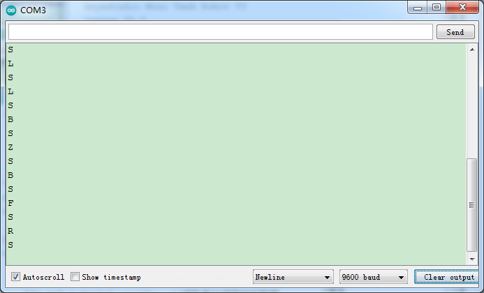

The following table illustrates the functions of corresponding keys:

| Keys                                            | Functions                                                                                                          |
|  | Pair and connect HM-10 Bluetooth module;click again to disconnect                                                                         |                                                                                |
|  | select the robot to operate                                                                                                               |                                                                                |
|  | to control the movements of the robot by buttons                                                                                          |                                                                                |
|  | To control the movements of the robot by joystick                                                                                         |                                                                                |
|  | To control the movements of the robot by gravity                                                                                          |                                                                                |
|  | Send “F”when pressed and “S”when released                                                                                                 | The car moves forward when it is pressed and stops when released               |
|  | Send “L”when pressed and “S”when released                                                                                                 | The car turns left when it is pressed tight and stops when released            |
|  | Send “R”when pressed and “S”when released                                                                                                 | The car turns right when it is pressed tight and stops when released           |
|  | Send “B”when pressed and “S”when released                                                                                                 | The car turns back when it is pressed tight and stops when released            |
|  | Send “u”+digit+“\#”when dragged                                                                                                           | Drag to change the speed of the left motor                                     |
|  | Send “v”+digit+“\#”when dragged                                                                                                           | Drag to change the speed of the right motor                                    |
|  | Select to enter Function page                                                                                                             |                                                                                |
|  | Send “G”when pressed and “S”when pressed again                                                                                            | Enter obstacle avoidance mode when pressed and exit when pressed again         |
|  | Send “h”when pressed and “S”when pressed again                                                                                            | Enter following mode when pressed and exit when pressed again                  |
|  | Send “e”when pressed and “S”when pressed again                                                                                            | Enter line-tracking mode when pressed and exit when pressed again              |
|  | Send “f”when pressed and “S”when pressed again                                                                                            | Enter move-in-confined-space mode when pressed and exit when pressed again     |
|  | Send “i”when pressed and “S”when pressed again                                                                                            | Enter light following mode when pressed and exit when pressed again            |
|  | Send “j”when pressed and “S”when pressed again                                                                                            | Enter fire extinguishing mode when pressed and exit when pressed again         |
|  | Select to enter facial expression display mode                                                                                            |                                                                                |
|  | Send “k”when pressed and “z”when pressed again                                                                                            | Show smiling pattern when clicked and clear expression when clicked again      |
|  | Send “l”when pressed and “z”when pressed again                                                                                            | Show disgusting pattern when clicked and clear expression when clicked again   |
|  | Send “m”when pressed and “z”when pressed again                                                                                            | Show happy face when clicked and clear expression when clicked again           |
|  | Send “n”when pressed and “z”when pressed again                                                                                            | Show sad pattern when clicked and clear expression when clicked again          |
|  | Send “o”when pressed and “z”when pressed again                                                                                            | Show disparaging pattern when clicked and clear expression when clicked again  |
|  | Send “p”when pressed and “z”when pressed again                                                                                            | Show heart-shaped pattern when clicked and clear expression when clicked again |
|  | Choose to enter the custom function interface; there are six keys 1,2,3,4,5,6; with these keys, you can expand some functions by yourself |                                                                                |
|  | Click to send “w”                                                                                                                         | Click to display the analog value detected by the photoresistor on the left    |
|  | Click to send“y”                                                                                                                          | Click to display the analog value detected by the photoresistor on the right   |
|  | Click to send“x”                                                                                                                          | Click to show the distance detected by ultrasonic sensor (unit: cm)            |
|  | Click to send“c” Click again to send“d”                                                                                                   | Press to turn on the fan and press again to turn off it                        |

Flow Chart

**(3) Wiring Diagram**

The GND, VCC, SDA, and SCL of the 8x16 LED dot matrix are respectively connected
to-(GND), + (VCC), SDA, SCL of the expansion board;

The STATE and BRK pins of the Bluetooth module do not need to be connected.

1. Test Code

(Note: When uploading the code, the Bluetooth module must be unplugged, and the
Bluetooth can be reconnected after the uploading process. Otherwise the code may
not be burned.)

/\*

Keyestudio Mini Tank Robot V3 (Popular Edition)

lesson 20.2

bluetooth tank

http://www.keyestudio.com

\*/

//Array, used to save data of images, can be calculated by yourself or gotten
from modulus tool

unsigned char start01[] = {0x01, 0x02, 0x04, 0x08, 0x10, 0x20, 0x40, 0x80, 0x80,
0x40, 0x20, 0x10, 0x08, 0x04, 0x02, 0x01};

unsigned char front[] = {0x00, 0x00, 0x00, 0x00, 0x00, 0x24, 0x12, 0x09, 0x12,
0x24, 0x00, 0x00, 0x00, 0x00, 0x00, 0x00};

unsigned char back[] = {0x00, 0x00, 0x00, 0x00, 0x00, 0x24, 0x48, 0x90, 0x48,
0x24, 0x00, 0x00, 0x00, 0x00, 0x00, 0x00};

unsigned char left[] = {0x00, 0x00, 0x00, 0x00, 0x00, 0x00, 0x44, 0x28, 0x10,
0x44, 0x28, 0x10, 0x44, 0x28, 0x10, 0x00};

unsigned char right[] = {0x00, 0x10, 0x28, 0x44, 0x10, 0x28, 0x44, 0x10, 0x28,
0x44, 0x00, 0x00, 0x00, 0x00, 0x00, 0x00};

unsigned char STOP01[] = {0x2E, 0x2A, 0x3A, 0x00, 0x02, 0x3E, 0x02, 0x00, 0x3E,
0x22, 0x3E, 0x00, 0x3E, 0x0A, 0x0E, 0x00};

unsigned char clear[] = {0x00, 0x00, 0x00, 0x00, 0x00, 0x00, 0x00, 0x00, 0x00,
0x00, 0x00, 0x00, 0x00, 0x00, 0x00, 0x00};

\#define SCL_Pin A5 //设Set the clock pin as A5

\#define SDA_Pin A4 //Set the data pin as A4

\#define ML_Ctrl 4 //Define the direction control pin of the left motor

\#define ML_PWM 6 //Define the PWM control pin of the left motor

\#define MR_Ctrl 2 //Define the direction control pin of the right motor

\#define MR_PWM 5 //Define the PWM control pin of the right motor

char ble_val; //Used to store the value obtained by Bluetooth

void setup() {

Serial.begin(9600);

pinMode(ML_Ctrl, OUTPUT);

pinMode(ML_PWM, OUTPUT);

pinMode(MR_Ctrl, OUTPUT);

pinMode(MR_PWM, OUTPUT);

pinMode(SCL_Pin, OUTPUT);

pinMode(SDA_Pin, OUTPUT);

matrix_display(clear); //clear screens

matrix_display(start01); //show the image to start

}

void loop() {

if (Serial.available())

{

ble_val = Serial.read();

Serial.println(ble_val);

}

switch (ble_val)

{

case 'F': //the command to go front

Car_front();

break;

case 'B': //the command to go back

Car_back();

break;

case 'L': //the command to turn left

Car_left();

break;

case 'R': //the command to turn right

Car_right();

break;

case 'S': //the command to stop

Car_Stop();

break;

}

}

/\*\*\*\*\*The function to run the
motor\*\*\*\*\*/

void Car_back() {

digitalWrite(MR_Ctrl, LOW);

analogWrite(MR_PWM, 200);

digitalWrite(ML_Ctrl, LOW);

analogWrite(ML_PWM, 200);

matrix_display(back); //Go back

}

void Car_front() {

digitalWrite(MR_Ctrl, HIGH);

analogWrite(MR_PWM, 55);

digitalWrite(ML_Ctrl, HIGH);

analogWrite(ML_PWM, 55);

matrix_display(front); //show the image to go front

}

void Car_left() {

digitalWrite(MR_Ctrl, HIGH);

analogWrite(MR_PWM, 55);

digitalWrite(ML_Ctrl, LOW);

analogWrite(ML_PWM, 200);

matrix_display(left); //show the image to turn lefr

}

void Car_right() {

digitalWrite(MR_Ctrl, LOW);

analogWrite(MR_PWM, 200);

digitalWrite(ML_Ctrl, HIGH);

analogWrite(ML_PWM, 55);

matrix_display(right); //show the image to turn right

}

void Car_Stop() {

digitalWrite(MR_Ctrl, LOW);

analogWrite(MR_PWM, 0);

digitalWrite(ML_Ctrl, LOW);

analogWrite(ML_PWM, 0);

matrix_display(STOP01); //show the image to stop

}

//This function is used for dot matrix screen display

void matrix_display(unsigned char matrix_value[])

{

IIC_start(); //Function to call data transfer start condition

IIC_send(0xc0); //Choose an address

for (int i = 0; i \< 16; i++) //Pattern data has 16 bytes

{

IIC_send(matrix_value[i]); //transfer pattern data

}

IIC_end(); //End pattern data transfer

IIC_start();

IIC_send(0x8A); //display control, select pulse width as 4/16

IIC_end();

}

//Conditions for the start of data transfer

void IIC_start()

{

digitalWrite(SDA_Pin, HIGH);

digitalWrite(SCL_Pin, HIGH);

delayMicroseconds(3);

digitalWrite(SDA_Pin, LOW);

delayMicroseconds(3);

digitalWrite(SCL_Pin, LOW);

}

//the sign of ending data transmission

void IIC_end()

{

digitalWrite(SCL_Pin, LOW);

digitalWrite(SDA_Pin, LOW);

delayMicroseconds(3);

digitalWrite(SCL_Pin, HIGH);

delayMicroseconds(3);

digitalWrite(SDA_Pin, HIGH);

delayMicroseconds(3);

}

//transfer data

void IIC_send(unsigned char send_data)

{

for (byte mask = 0x01; mask != 0; mask \<\<= 1) //each character has 8 digits,
which is detected one by one

{

if (send_data & mask) { //set high or low levels in light of each bit(0 or 1)

digitalWrite(SDA_Pin, HIGH);

} else {

digitalWrite(SDA_Pin, LOW);

}

delayMicroseconds(3);

digitalWrite(SCL_Pin, HIGH); //Pull the clock pin SCL_Pin high to stop data
transmission

delayMicroseconds(3);

digitalWrite(SCL_Pin, LOW); //pull down the clock pin SCL_Pin to change signals
of SDA

}

}

1. Test Result

After uploading the test code successfully, dialing the DIP switch to the right
end, powering it on, and pairing the APP with Bluetooth, the smart car can be
controlled to move by the APP.6）测

### Project 21: BT Speed Control Robot

1. **Description**

In the previous project, we learned how to control the smart tank with
Bluetooth. The PWM value of the motor we used in front of us is 200 (the speed
is 200). In this lesson, we will use Bluetooth to adjust the speed of the smart
car. It is not limited to Fixed speed of 200. We define two variables to store
the speed values of the left and right motors respectively. Through the previous
study, we know that the range of this value can only take 0 to 255.

**(2)Flow chart**

**(3)Connection Diagram:**

The GND, VCC, SDA, and SCL of the 8x16 LED dot matrix are respectively connected
to-(GND), + (VCC), SDA, SCL of the expansion board;

**(4)Test Code**

(Note:When uploading the code, the Bluetooth module must be unplugged, and the
Bluetooth can be reconnected after the uploading process. Otherwise the code may
not be burned.)

/\*

Keyestudio Mini Tank Robot V3 (Popular Edition)

lesson 21

bluetooth control speed tank

http://www.keyestudio.com

\*/

//Array, used to save data of images, can be calculated by yourself or gotten
from modulus tool

unsigned char start01[] = {0x01, 0x02, 0x04, 0x08, 0x10, 0x20, 0x40, 0x80, 0x80,
0x40, 0x20, 0x10, 0x08, 0x04, 0x02, 0x01};

unsigned char front[] = {0x00, 0x00, 0x00, 0x00, 0x00, 0x24, 0x12, 0x09, 0x12,
0x24, 0x00, 0x00, 0x00, 0x00, 0x00, 0x00};

unsigned char back[] = {0x00, 0x00, 0x00, 0x00, 0x00, 0x24, 0x48, 0x90, 0x48,
0x24, 0x00, 0x00, 0x00, 0x00, 0x00, 0x00};

unsigned char left[] = {0x00, 0x00, 0x00, 0x00, 0x00, 0x00, 0x44, 0x28, 0x10,
0x44, 0x28, 0x10, 0x44, 0x28, 0x10, 0x00};

unsigned char right[] = {0x00, 0x10, 0x28, 0x44, 0x10, 0x28, 0x44, 0x10, 0x28,
0x44, 0x00, 0x00, 0x00, 0x00, 0x00, 0x00};

unsigned char STOP01[] = {0x2E, 0x2A, 0x3A, 0x00, 0x02, 0x3E, 0x02, 0x00, 0x3E,
0x22, 0x3E, 0x00, 0x3E, 0x0A, 0x0E, 0x00};

unsigned char clear[] = {0x00, 0x00, 0x00, 0x00, 0x00, 0x00, 0x00, 0x00, 0x00,
0x00, 0x00, 0x00, 0x00, 0x00, 0x00, 0x00};

unsigned char speed_a[] = {0x00, 0x00, 0x00, 0x20, 0x10, 0x08, 0x04, 0x02, 0xff,
0x02, 0x04, 0x08, 0x10, 0x20, 0x00, 0x00};

unsigned char speed_d[] = {0x00, 0x00, 0x00, 0x04, 0x08, 0x10, 0x20, 0x40, 0xff,
0x40, 0x20, 0x10, 0x08, 0x04, 0x00, 0x00};

\#define SCL_Pin A5 //set the pin of clock to A5

\#define SDA_Pin A4 //A4 set data pin to A4

\#define ML_Ctrl 4 //define the direction control pin of the left motor

\#define ML_PWM 6 //define the PWM control pins of the left motor

\#define MR_Ctrl 2 //define the direction control pin of the right motor

\#define MR_PWM 5 //define the PWM control pin of the right motor

char ble_val; //define the PWM control pin of the right motor

byte speeds_L = 200; //The initial speed of the left motor is 200

byte speeds_R = 200; //The initial speed of the right motor is 200

String speeds_l, speeds_r; //Receive a string of PWM to convert to an integer
PWM value

void setup() {

Serial.begin(9600);

pinMode(ML_Ctrl, OUTPUT);

pinMode(ML_PWM, OUTPUT);

pinMode(MR_Ctrl, OUTPUT);

pinMode(MR_PWM, OUTPUT);

pinMode(SCL_Pin, OUTPUT);

pinMode(SDA_Pin, OUTPUT);

matrix_display(clear); //clear screens

matrix_display(start01); //show the image to start

}

void loop() {

if (Serial.available() \> 0) {

ble_val = Serial.read();

Serial.println(ble_val);

switch (ble_val) {

case 'F': //the command to go front

Car_front();

break;

case 'B': //the command to go back

Car_back();

break;

case 'L': //the command to turn left

Car_left();

break;

case 'R': //the command to turn right

Car_right();

break;

case 'S': //the command to stop

Car_Stop();

break;

case 'u': //Receive a string starting with u and ending with \#, and convert it
to an integer value

speeds_l = Serial.readStringUntil('\#');

speeds_L = String(speeds_l).toInt();

break;

case 'v': //Receive a string starting with v and ending with \#, and convert it
to an integer value

speeds_r = Serial.readStringUntil('\#');

speeds_R = String(speeds_r).toInt();

break;

}

}

}

/\*\*\*\*\*The function to run the
motor\*\*\*\*\*/

void Car_back() {

digitalWrite(MR_Ctrl, LOW);

analogWrite(MR_PWM, speeds_R);

digitalWrite(ML_Ctrl, LOW);

analogWrite(ML_PWM, speeds_L);

matrix_display(back); //Go back

}

void Car_front() {

digitalWrite(MR_Ctrl, HIGH);

analogWrite(MR_PWM, 255 - speeds_R);

digitalWrite(ML_Ctrl, HIGH);

analogWrite(ML_PWM, 255 - speeds_L);

matrix_display(front); //show the image to go front

}

void Car_left() {

digitalWrite(MR_Ctrl, HIGH);

analogWrite(MR_PWM, 255 - speeds_R);

digitalWrite(ML_Ctrl, LOW);

analogWrite(ML_PWM, speeds_L);

matrix_display(left); //show the image to turn left

}

void Car_right() {

digitalWrite(MR_Ctrl, LOW);

analogWrite(MR_PWM, speeds_R);

digitalWrite(ML_Ctrl, HIGH);

analogWrite(ML_PWM, 255 - speeds_L);

matrix_display(right); //show the image to turn right

}

void Car_Stop() {

digitalWrite(MR_Ctrl, LOW);

analogWrite(MR_PWM, 0);

digitalWrite(ML_Ctrl, LOW);

analogWrite(ML_PWM, 0);

matrix_display(STOP01); //show the image to stop

}

//This function is used for dot matrix screen display

void matrix_display(unsigned char matrix_value[])

{

IIC_start(); //Function to call data transfer start condition

IIC_send(0xc0); //Choose an address

for (int i = 0; i \< 16; i++) //Pattern data has 16 bytes

{

IIC_send(matrix_value[i]); //transfer pattern data

}

IIC_end(); //End pattern data transfer

IIC_start();

IIC_send(0x8A); //display control, select pulse width as 4/16

IIC_end();

}

//Conditions for the start of data transfer

void IIC_start()

{

digitalWrite(SDA_Pin, HIGH);

digitalWrite(SCL_Pin, HIGH);

delayMicroseconds(3);

digitalWrite(SDA_Pin, LOW);

delayMicroseconds(3);

digitalWrite(SCL_Pin, LOW);

}

//the sign of ending data transmission

void IIC_end()

{

digitalWrite(SCL_Pin, LOW);

digitalWrite(SDA_Pin, LOW);

delayMicroseconds(3);

digitalWrite(SCL_Pin, HIGH);

delayMicroseconds(3);

digitalWrite(SDA_Pin, HIGH);

delayMicroseconds(3);

}

//transfer data

void IIC_send(unsigned char send_data)

{

for (byte mask = 0x01; mask != 0; mask \<\<= 1) //each character has 8 digits,
which is detected one by one

{

if (send_data & mask) { //set high or low levels in light of each bit(0 or 1)

digitalWrite(SDA_Pin, HIGH);

} else {

digitalWrite(SDA_Pin, LOW);

}

delayMicroseconds(3);

digitalWrite(SCL_Pin, HIGH); //Pull the clock pin SCL_Pin high to stop data
transmission

delayMicroseconds(3);

digitalWrite(SCL_Pin, LOW); //pull down the clock pin SCL_Pin to change signals
of SDA

}

}

**(5)Test Results:**

After uploading the test code successfully, dialing the DIP switch to the right
end, powering it on, and pairing the APP with Bluetooth, the smart car can be
controlled to move by the APP. And the speed of the car can be regulated by
pulling the speed dials of the left and right motors.

(You can refer to function table in project 20 )测试结

### Project 22: Multifunctional Tank

**(1)Description:**

The smart car has performed a single function in every previous project. Can it
display multiply functions at a time ? Positive. In this last big project, we
intend to use a complete code to control the smart car to show off all functions
mentioned in previous projects. We use the keys on the Bluetooth APP to
automatically switch various functions, quite simple and convenient

**(2) Connection Diagram:**

1. **Wire Connection：**

2. GND, VCC, SDA and SCL of the 8x16 board are connected to G（GND), +（VCC),
   A4 and A5 of the expansion board.

2\. VCC, Trig, Echo and Gnd of the ultrasonic sensor are connected to 5V(V),
12(S), 13(S) and Gnd(G)

3\. The brown wire, red wire and orange wire of the servo are connected to
Gnd(G), 5v(V) and D10.

4\. RXD, TXD, GND and VCC of the BT module are connected to TX, RX, G（GND) and
5V（VCC）

STATE and BRK don’t need to be interfaced.

5\. The pin "G", "V" and S of the left photoresistor module are connected to G
(GND), V (VCC), A1 respectively;

The right photoresistor module is connected to the G (GND), V (VCC), and A2
respectively.

6\. The distal port of the line tracking sensor is 11, 7 and 8

**(4) Test Code**

/\*

Keyestudio Mini Tank Robot V3 (Popular Edition)

lesson 22

multiple functions

http://www.keyestudio.com

\*/

\#include \<IRremote.h\>

IRrecv irrecv(3); //

decode_results results;

long ir_rec; //used to save the IR value

/\*/

\#define USE_FAN_FUNCTION 0

//Array, used to save data of images, can be calculated by yourself or gotten
from modulus tool

unsigned char start01[] = {0x01, 0x02, 0x04, 0x08, 0x10, 0x20, 0x40, 0x80, 0x80,
0x40, 0x20, 0x10, 0x08, 0x04, 0x02, 0x01};

unsigned char STOP01[] = {0x2E, 0x2A, 0x3A, 0x00, 0x02, 0x3E, 0x02, 0x00, 0x3E,
0x22, 0x3E, 0x00, 0x3E, 0x0A, 0x0E, 0x00};

unsigned char front[] = {0x00, 0x00, 0x00, 0x00, 0x00, 0x24, 0x12, 0x09, 0x12,
0x24, 0x00, 0x00, 0x00, 0x00, 0x00, 0x00};

unsigned char back[] = {0x00, 0x00, 0x00, 0x00, 0x00, 0x24, 0x48, 0x90, 0x48,
0x24, 0x00, 0x00, 0x00, 0x00, 0x00, 0x00};

unsigned char left[] = {0x00, 0x00, 0x00, 0x00, 0x00, 0x00, 0x44, 0x28, 0x10,
0x44, 0x28, 0x10, 0x44, 0x28, 0x10, 0x00};

unsigned char right[] = {0x00, 0x10, 0x28, 0x44, 0x10, 0x28, 0x44, 0x10, 0x28,
0x44, 0x00, 0x00, 0x00, 0x00, 0x00, 0x00};

unsigned char Smile[] = {0x00, 0x00, 0x1c, 0x02, 0x02, 0x02, 0x5c, 0x40, 0x40,
0x5c, 0x02, 0x02, 0x02, 0x1c, 0x00, 0x00};

unsigned char Disgust[] = {0x00, 0x00, 0x02, 0x02, 0x02, 0x12, 0x08, 0x04, 0x08,
0x12, 0x22, 0x02, 0x02, 0x00, 0x00, 0x00};

unsigned char Happy[] = {0x02, 0x02, 0x02, 0x02, 0x08, 0x18, 0x28, 0x48, 0x28,
0x18, 0x08, 0x02, 0x02, 0x02, 0x02, 0x00};

unsigned char Squint[] = {0x00, 0x00, 0x00, 0x41, 0x22, 0x14, 0x48, 0x40, 0x40,
0x48, 0x14, 0x22, 0x41, 0x00, 0x00, 0x00};

unsigned char Despise[] = {0x00, 0x00, 0x06, 0x04, 0x04, 0x04, 0x24, 0x20, 0x20,
0x26, 0x04, 0x04, 0x04, 0x04, 0x00, 0x00};

unsigned char Heart[] = {0x00, 0x00, 0x0C, 0x1E, 0x3F, 0x7F, 0xFE, 0xFC, 0xFE,
0x7F, 0x3F, 0x1E, 0x0C, 0x00, 0x00, 0x00};

unsigned char clear[] = {0x00, 0x00, 0x00, 0x00, 0x00, 0x00, 0x00, 0x00, 0x00,
0x00, 0x00, 0x00, 0x00, 0x00, 0x00, 0x00};

\#define SCL_Pin A5 //set the pin of clock to A5

\#define SDA_Pin A4 //set the data pin to A4

\#define ML_Ctrl 4 /define the direction control pin of the left motor as 4

\#define ML_PWM 6 //define the PWM control pin of the left motor

\#define MR_Ctrl 2 //define the direction control pin of the right sensor

\#define MR_PWM 5 /define the PWM control pin of the right motor

char ble_val; //used to save the Bluetooth value

byte speeds_L = 200; //the initial speed of the left motor is 200

byte speeds_R = 200; //the initial speed of the right motor is 200

String speeds_l, speeds_r; //receive PWM characters and convert them into PWM
value

//wire up the line tracking sensor

\#define L_pin 11 //left

\#define M_pin 7 //middle

\#define R_pin 8 //right

int L_val, M_val, R_val;

\#if USE_FAN_FUNCTION /\*\*\*\*use fan\*\*\*\*\*\*\*/

int flame_L = A1; //define the analog port of the left flame sensor to A1

int flame_R = A2; //define the analog port of the right flame sensor to A2

int flame_valL, flame_valR;

//the pin of 130 motor

int INA = 12;

int INB = 13;

\#else /\*\*\*\*use the ultrasonic sensor\*\*\*\*\*\*\*/

\#define servoPin 10 //servo Pin

\#define light_L_Pin A1 //define the pin of the left photoresistor

\#define light_R_Pin A2 //define the pin of the right photoresistor

int left_light;

int right_light;

\#define Trig 12

\#define Echo 13

float distance;//Store the distance values detected by ultrasonic for following

/Store the distance values detected by ultrasonic for obstacle avoidance

int a;

int a1;

int a2;

\#endif

bool flag; //flag invariable, used to enter and exit a mode

void setup() {

Serial.begin(9600);

irrecv.enableIRIn(); //Initialize the library of the IR remote

pinMode(SCL_Pin, OUTPUT);

pinMode(SDA_Pin, OUTPUT);

pinMode(ML_Ctrl, OUTPUT);

pinMode(ML_PWM, OUTPUT);

pinMode(MR_Ctrl, OUTPUT);

pinMode(MR_PWM, OUTPUT);

pinMode(L_pin, INPUT); //define the pins of sensors to INPUT

pinMode(M_pin, INPUT);

pinMode(R_pin, INPUT);

matrix_display(clear); //clear screen

matrix_display(start01); //show start

\#if USE_FAN_FUNCTION/\*\*\*\*use the fan\*\*\*\*\*\*\*/

pinMode(INA, OUTPUT);//set INA to OUTPUT

pinMode(INB, OUTPUT);//set INB to OUTPUT

//define inputs of the flame sensor

pinMode(flame_L, INPUT);

pinMode(flame_R, INPUT);

\#else/\*\*\*\*use the ultrasonic sensor\*\*\*\*\*\*\*/

pinMode(servoPin, OUTPUT);

pinMode(light_L_Pin, INPUT);

pinMode(light_R_Pin, INPUT);

pinMode(Trig, OUTPUT);

pinMode(Echo, INPUT);

procedure(90); //set the angle of the servo to 90°

\#endif

}

void loop() {

if (Serial.available()) //if there is data in the serial buffer

{

ble_val = Serial.read();

Serial.println(ble_val);

switch (ble_val) {

case 'F': Car_front(); break; //the command to go front

case 'B': Car_back(); break; //the command to go back

case 'L': Car_left(); break; //the command to turn left

case 'R': Car_right(); break; //the command to turn right

case 'S': Car_Stop(); break; //stop

case 'e': Tracking(); break; //enter the line tracking mode

case 'f': Confinement(); break; //enter the confinement mode

\#if USE_FAN_FUNCTION/\*\*\*\*use fan\*\*\*\*\*\*\*/

case 'j': Fire(); break; //enable extinguishing fire mode

case 'c': fan_begin(); break; //enable the fan

case 'd': fan_stop(); break; //turn off the fan

\#else/\*\*\*\*use the ultrasonic sensor\*\*\*\*\*\*\*/

case 'g': Avoid(); break; //enter obstacle avoidance mode

case 'h': Follow(); break; //enter light following mode

case 'i': Light_following(); break; //enter light following mode

\#endif

case 'u':

speeds_l = Serial.readStringUntil('\#');

speeds_L = String(speeds_l).toInt();

break; //start by receiving u, end by receiving characters \# and convert into
the integer

case 'v':

speeds_r = Serial.readStringUntil('\#');

speeds_R = String(speeds_r).toInt();

break; //start by receiving u, end by receiving characters \# and convert into
the integer

case 'k': matrix_display(Smile); break; //show "smile" face

case 'l': matrix_display(Disgust); break; //show "disgust" face

case 'm': matrix_display(Happy); break; //show "happy" face

case 'n': matrix_display(Squint); break; //show "Sad" face

case 'o': matrix_display(Despise); break; //show "despise" face

case 'p': matrix_display(Heart); break; //show the hearbeat image

case 'z': matrix_display(clear); break; //clear images

default: break;

}

}

\#if (USE_FAN_FUNCTION != 1)/\*\*\*\*the function to not use the
fan\*\*\*\*\*\*\*/

//The following three signals are mainly used for cyclic printing

if (ble_val == 'x') {

distance = checkdistance(); Serial.println(distance);

delay(50);

} else if (ble_val == 'w') {

left_light = analogRead(light_L_Pin);

Serial.println(left_light);

delay(50);

} else if (ble_val == 'y') {

right_light = analogRead(light_R_Pin);

Serial.println(right_light);

delay(50);

}

\#endif

if (irrecv.decode(&results)) { //Receive infrared remote control value

ir_rec = results.value;

Serial.println(ir_rec, HEX);

switch (ir_rec) {

case 0xFF629D: Car_front(); break; //go front

case 0xFFA857: Car_back(); break; //go back

case 0xFF22DD: Car_left(); break; //rotate to left

case 0xFFC23D: Car_right(); break; //rotate to right

case 0xFF02FD: Car_Stop(); break; //stop

default: break;

}

irrecv.resume();

}

}

\#if (USE_FAN_FUNCTION != 1)/\*\*\*\*use the ultrasonic sensor\*\*\*\*\*\*\*/

//Control the ultrasonic sensor

float checkdistance() {

float distance;

digitalWrite(Trig, LOW);

delayMicroseconds(2);

digitalWrite(Trig, HIGH);

delayMicroseconds(10);

digitalWrite(Trig, LOW);

distance = pulseIn(Echo, HIGH) / 58.20; //

delay(10);

return distance;

}

//the function to control the servo

void procedure(int myangle) {

int pulsewidth;

pulsewidth = map(myangle, 0, 180, 500, 2000); //Calculate the pulse width value,
which should be the mapping value from 500 to 2500. Considering the influence of
the infrared library, 500\~2000 is used here.

for (int i = 0; i \< 5; i++) {

digitalWrite(servoPin, HIGH);

delayMicroseconds(pulsewidth); //The duration of the high level is the pulse
width

digitalWrite(servoPin, LOW);

delay((20 - pulsewidth / 1000)); //The period is 20ms, so the low level lasts
the rest of the time

}

}

/\*\*\*\*\*\*\*obstacle
avoidance/

void Avoid()

{

flag = 0;

while (flag == 0)

{

a = checkdistance(); //the front distance is set to a

if (a \< 20) {//When the distance in front is less than 20cm

Car_Stop(); //stop

delay(500); //delay in 500ms

procedure(180); //servo turns left

delay(500); //delay in 500ms

a1 = checkdistance(); //the left distance is set to a1

delay(100); //read value

procedure(0); //servo turns right

delay(500); //delay in 500ms

a2 = checkdistance(); ///the right distance is set to a2

delay(100); //read value

procedure(90); //back to 90°

delay(500);

if (a1 \> a2) { //When the distance on the left is greater than the distance on
the right

Car_left(); //the robot turns left

delay(700); //turn left 700ms

} else {

Car_right(); //turn right

delay(700);

}

}

else { //if the front distance ≥20cm，robot goes front

Car_front(); //go front

}

//receive the Bluetooth value to exit the loop

if (Serial.available())

{

ble_val = Serial.read();

if (ble_val == 'S') //receive S

{

flag = 1; //Set flag to 1 to exit the loop

Car_Stop();

}

}

}

}

/\*following\*\*\*\*\*/

void Follow() {

flag = 0;

while (flag == 0) {

distance = checkdistance(); //set the distance value to distance

if (distance \>= 20 && distance \<= 60) //go front

{

Car_front();

}

else if (distance \> 10 && distance \< 20) // stop

{

Car_Stop();

}

else if (distance \<= 10) //go back

{

Car_back();

}

else //stop

{

Car_Stop();

}

if (Serial.available())

{

ble_val = Serial.read();

if (ble_val == 'S')

{

flag = 1; //exit the loop

Car_Stop();

}

}

}

}

/\*\*\*\*\*\*light
following/

void Light_following() {

flag = 0;

while (flag == 0) {

left_light = analogRead(light_L_Pin);

right_light = analogRead(light_R_Pin);

if (left_light \> 650 && right_light \> 650) //go forward

{

Car_front();

}

else if (left_light \> 650 && right_light \<= 650) //turn left

{

Car_left();

}

else if (left_light \<= 650 && right_light \> 650) //turn right

{

Car_right();

}

else //or else, stop

{

Car_Stop();

}

if (Serial.available())

{

ble_val = Serial.read();

if (ble_val == 'S') {

flag = 1;

Car_Stop();

}

}

}

}

\#else/\*\*\*\*use the fan\*\*\*\*\*\*\*/

/\*\*\*\*\*enable the fan\*\*\*\*\*\*\*/

void fan_begin() {

digitalWrite(INA, LOW);

digitalWrite(INB, HIGH);

}

/\*\*\*\*\*stop fanning\*\*\*\*\*\*\*/

void fan_stop() {

digitalWrite(INA, LOW);

digitalWrite(INB, LOW);

}

/\*\*\*\*\*extinguish fire\*\*\*\*\*\*/

void Fire() {

flag = 0;

while (flag == 0) {

//Read the analog value of the flame sensor

flame_valL = analogRead(flame_L);

flame_valR = analogRead(flame_R);

if (flame_valL \<= 700 \|\| flame_valR \<= 700) {

Car_Stop();

fan_begin();

} else {

fan_stop();

L_val = digitalRead(L_pin); //Read the value of the left sensor

M_val = digitalRead(M_pin); //Read the value of the left sensor

R_val = digitalRead(R_pin); //Read the value of the right sensor

if (M_val == 1) { //the middle one detects black lines

if (L_val == 1 && R_val == 0) { //If a black line is detected on the left, but
not on the right, turn left

Car_left();

}

else if (L_val == 0 && R_val == 1) { //If a black line is detected on the right,
not on the left, turn right

Car_right();

}

else { //go front

Car_front();

}

}

else { //the middle one detects black lines

if (L_val == 1 && R_val == 0) { //If a black line is detected on the left, but
not on the right, turn left

Car_left();

}

else if (L_val == 0 && R_val == 1) { //If a black line is detected on the right,
not on the left, turn right

Car_right();

}

else { //otherwise stop

Car_Stop();

}

}

}

if (Serial.available())

{

ble_val = Serial.read();

if (ble_val == 'S') {

flag = 1;

Car_Stop();

}

}

}

}

\#endif

/\*\*\*\*\*line tracking\*\*\*\*\*\*\*/

void Tracking() {

flag = 0;

while (flag == 0) {

L_val = digitalRead(L_pin); //Read the value of the left sensor

M_val = digitalRead(M_pin); //Read the value of the intermediate sensor

R_val = digitalRead(R_pin); //Read the value of the sensor on the right

if (M_val == 1) { //the middle one detects black lines

if (L_val == 1 && R_val == 0) { //If a black line is detected on the left, but
not on the right, turn left

Car_left();

}

else if (L_val == 0 && R_val == 1) { //If a black line is detected on the right,
not on the left, turn right

Car_right();

}

else { //go front

Car_front();

}

}

else { //the middle sensor doesn’t detect black lines

if (L_val == 1 && R_val == 0) { //If a black line is detected on the left, but
not on the right, turn left

Car_left();

}

else if (L_val == 0 && R_val == 1) { //If a black line is detected on the right,
not on the left, turn right

Car_right();

}

else { //otherwise stop

Car_Stop();

}

}

if (Serial.available())

{

ble_val = Serial.read();

if (ble_val == 'S') {

flag = 1;

Car_Stop();

}

}

}

}

/\*\*\*\*\*Confinement\*\*\*\*\*\*\*/

void Confinement() {

flag = 0;

while (flag == 0) {

L_val = digitalRead(L_pin); //Read the value of the left sensor

M_val = digitalRead(M_pin); //Read the value of the intermediate sensor

R_val = digitalRead(R_pin); //Read the value of the sensor on the right

if ( L_val == 0 && M_val == 0 && R_val == 0 ) { //Go front when no black lines
are detected Car_front();

}

else { //

Car_back();

delay(700);

Car_left();

delay(800);

}

if (Serial.available())

{

ble_val = Serial.read();

if (ble_val == 'S') {

flag = 1;

Car_Stop();

}

}

}

}

/\*\*\*\*\*dot matrix/

//this function is used for the display of dot matrix

void matrix_display(unsigned char matrix_value[])

{

IIC_start(); //use the function to start transmitting data

IIC_send(0xc0); //select an address

for (int i = 0; i \< 16; i++) //image data have 16 characters

{

IIC_send(matrix_value[i]); //data to transmit pictures

}

IIC_end(); //end the data transmission of pictures

IIC_start();

IIC_send(0x8A); //show control and select pulse width 4/16

IIC_end();

}

//the condition that data starts transmitting

void IIC_start()

{

digitalWrite(SDA_Pin, HIGH);

digitalWrite(SCL_Pin, HIGH);

delayMicroseconds(3);

digitalWrite(SDA_Pin, LOW);

delayMicroseconds(3);

digitalWrite(SCL_Pin, LOW);

}

//transmit data

void IIC_send(unsigned char send_data)

{

for (byte mask = 0x01; mask != 0; mask \<\<= 1) //each character has 8 digits,
which is detected one by one

{

if (send_data & mask) { //set high or low levels in light of each bit(0 or 1)

digitalWrite(SDA_Pin, HIGH);

} else {

digitalWrite(SDA_Pin, LOW);

}

delayMicroseconds(3);

digitalWrite(SCL_Pin, HIGH); //pull up the clock pin SCL_Pin to end the
transmission of data

delayMicroseconds(3);

digitalWrite(SCL_Pin, LOW); //pull down the clock pin SCL_Pin to change signals
of SDA

}

}

//the sign that transmission of data ends

void IIC_end()

{

digitalWrite(SCL_Pin, LOW);

digitalWrite(SDA_Pin, LOW);

delayMicroseconds(3);

digitalWrite(SCL_Pin, HIGH);

delayMicroseconds(3);

digitalWrite(SDA_Pin, HIGH);

delayMicroseconds(3);

}

/\*\*\*\*\*motor runs\*\*\*\*\*\*/

void Car_back() {

digitalWrite(MR_Ctrl, LOW);

analogWrite(MR_PWM, speeds_R);

digitalWrite(ML_Ctrl, LOW);

analogWrite(ML_PWM, speeds_L);

matrix_display(back); //show the image of going back

}

void Car_front() {

digitalWrite(MR_Ctrl, HIGH);

analogWrite(MR_PWM, 255 - speeds_R);

digitalWrite(ML_Ctrl, HIGH);

analogWrite(ML_PWM, 255 - speeds_L);

matrix_display(front); //show the image of going front

}

void Car_left() {

digitalWrite(MR_Ctrl, HIGH);

analogWrite(MR_PWM, 255 - speeds_R);

digitalWrite(ML_Ctrl, LOW);

analogWrite(ML_PWM, speeds_L);

matrix_display(left); //show the image of turning left

}

void Car_right() {

digitalWrite(MR_Ctrl, LOW);

analogWrite(MR_PWM, speeds_R);

digitalWrite(ML_Ctrl, HIGH);

analogWrite(ML_PWM, 255 - speeds_L);

matrix_display(right); //show the image of turning right

}

void Car_Stop() {

digitalWrite(MR_Ctrl, LOW);

analogWrite(MR_PWM, 0);

digitalWrite(ML_Ctrl, LOW);

analogWrite(ML_PWM, 0);

matrix_display(STOP01); //show the stop image

}

1. Test Result

Before uploading the program code, the Bluetooth module needs to be removed,
otherwise the code upload will fail.

After uploading the code successfully, open the positioning, and then connect
the Bluetooth module.

After uploading the code successfully, plug in the Bluetooth module, after
power-on, after the mobile APP is connected to the Bluetooth successfully, we
can use the mobile APP to control the tank robot

You can also control the robot with the remote control

Some modules work through an IO port. If you need to use the fan module and the
flame sensor, you need to \#define USE_FAN_FUNCTION 0 into \#define
USE_FAN_FUNCTION

          |
## **8: Resource:**

Download libraries, app and other documents in the link:

https://fs.keyestudio.com/KS0555
